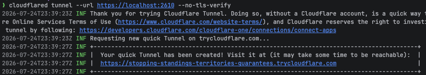

# Setting up a Multiplayer Proxy
If you want to allow access to your multiplayer server from a non-local IP address, you can either use port forwarding, or a proxy service.

## Cloudflare Tunnels

This guide will take you through setting up a temporary proxy address with `cloudflared`. Please note that this use is subject to the [Cloudflare Online Services Terms of Use](https://www.cloudflare.com/website-terms/).

To get started, you must install `cloudflared` for your operating system. Instructions can be found on [Cloudflare's website](https://developers.cloudflare.com/cloudflare-one/networks/connectors/cloudflare-tunnel/downloads/)

After installation, simply run your multiplayer server in secure mode and then the following command:

`cloudflared tunnel --url https://localhost:2610 --no-tls-verify`

If you are running your server on a non-default port, make sure to update the above commmand accordingly

The `--no-tls-verify` flag is to tell Cloudflare to accept the self-signed certificate generated by the Synthesis multiplayer server. Users connecting to your proxy will be served a trusted TLS certificate signed by Cloudflare. All traffic will be fully encrypted from client devices to the server. 

After running the command, you should see a URL printed to your terminal. Copy just the domain portion of the url (without the `https://` prefix) and use it as the host in the Synthesis client.

> [!NOTE]
> Regardless of your local server port, clients should use port `443` to access the server.

 