# Loopback adapter manual setup

## Add the "hardware"

1. Right click on the start button

2. Click `Device Manager`

3. Click the name of the computer at the top of the list

4. Click the `Action` tab, then click `Add legacy hardware`

   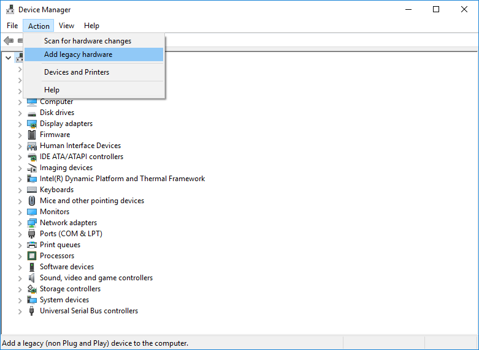

5. Click `Next`

   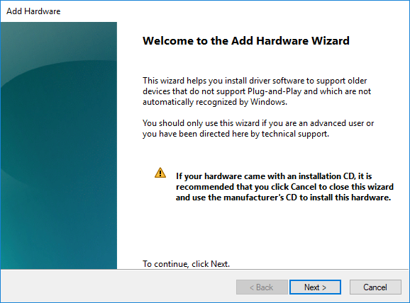

6. Click `Install the hardware that I manually select from a list`, then click `Next` again

   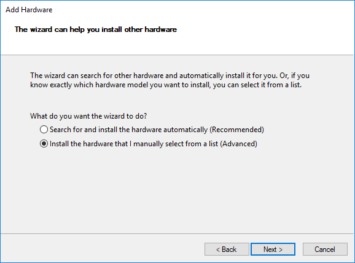

7. Scroll down and select the `Network adapters` and then click `Next`

   

8. Click the `Microsoft` option under `Manufacturers` and then click `Microsoft KM-TEST Loopback Adapter`, and then click `Next`

   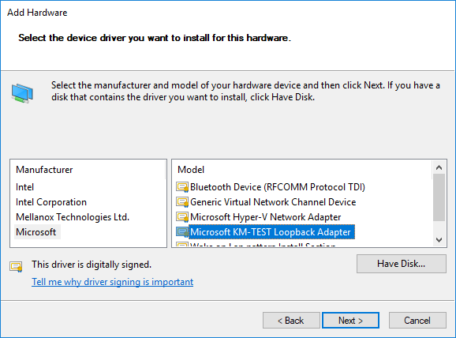

9. Click `Next` again

   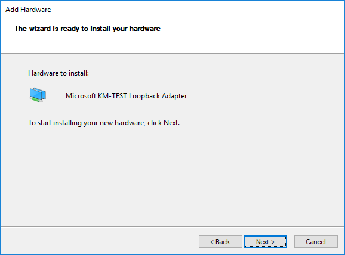

   10. Finally, click `Finish`

   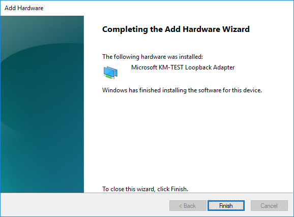

## Set the IP

1. Open the `Network and Sharing Center`, one way to do this is by right-clicking the network status in the taskbar and clicking the `Open Network and Sharing Center` button.

   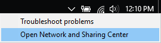

2. From there, click the `Change adapter settings` button in the top left (Underlined in the screenshot):

   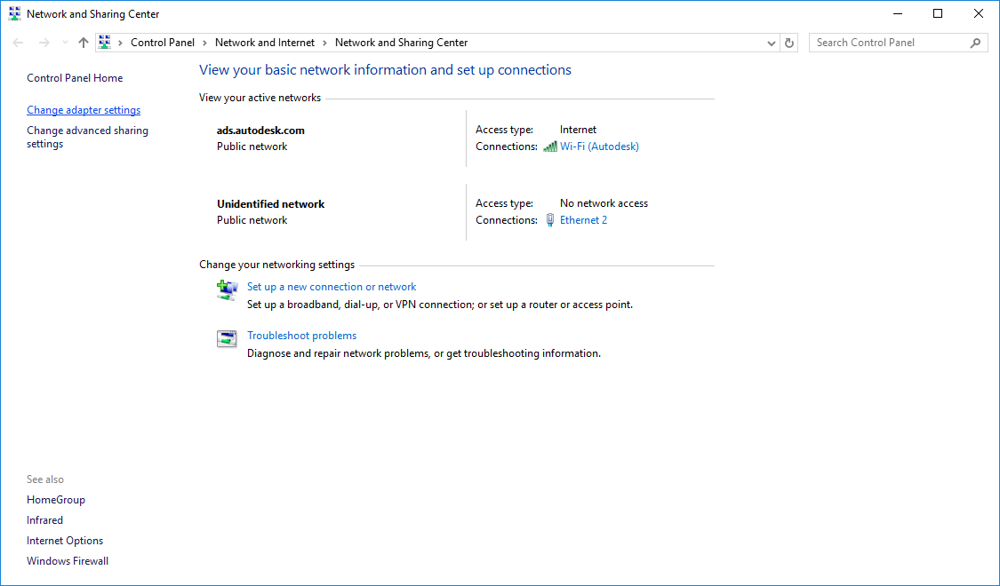

3. Right click the `Microsoft KM-TEST Loopback Adapter` device and click `Properties`:

   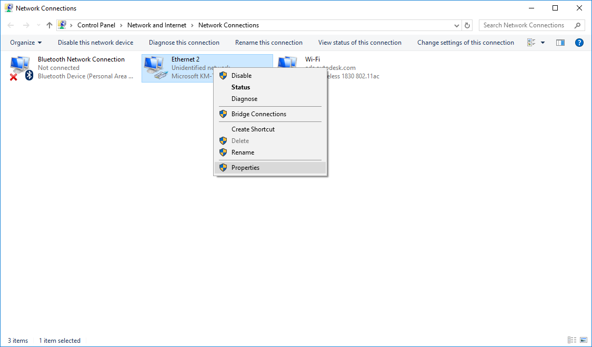

4. Double click the `Internet Protocol Version 4 (TCP/IPv4)` name (not the checkbox):

   

5. Disable automatic IP acquisition and set the IP address and subnet mask as shown, replacing the `77.77` with your team number:

   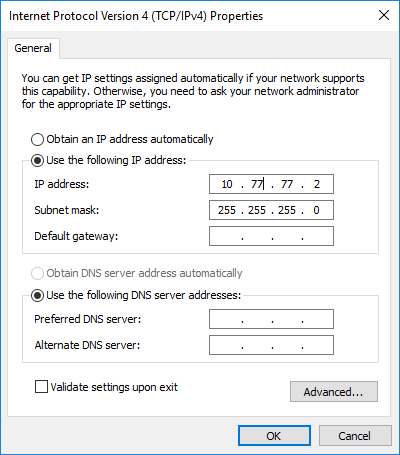

6. Finally, click the `OK` buttons to close the dialogs.

## How to remove the loopback adapter

   1. Right click the start button

   2. Click `Device Manager`

   3. Expand the `Network adapters` section, right click the `Microsoft KM-TEST Loopback Adapter`, and click `Uninstall device`

      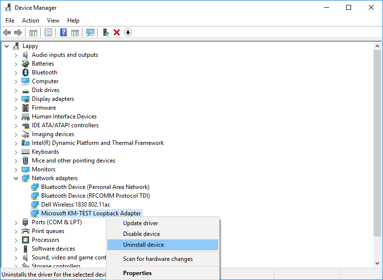

   4. A new window will open, just click `Next`. 

   5. That's it.