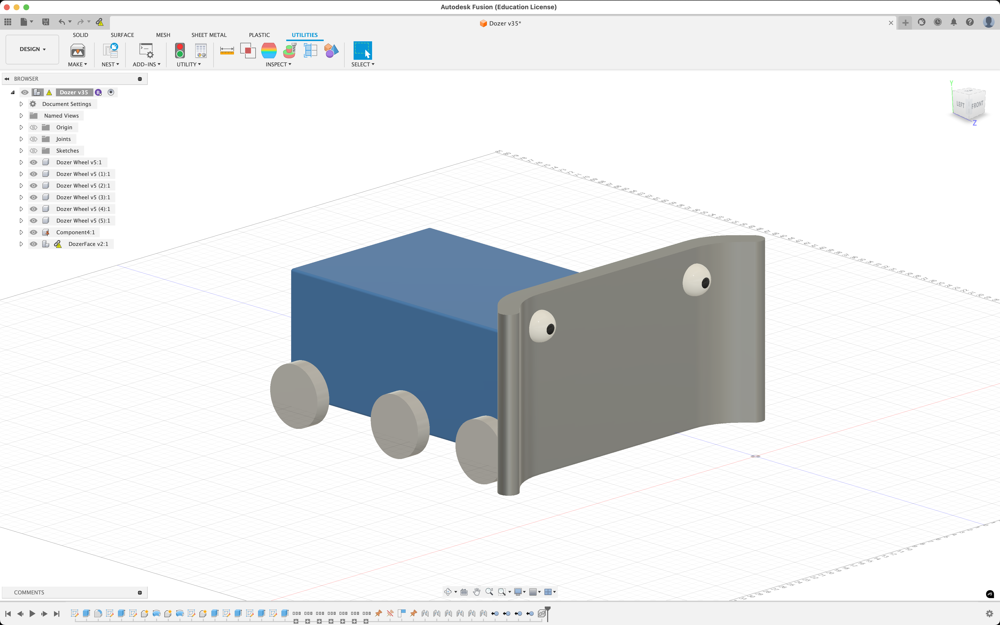
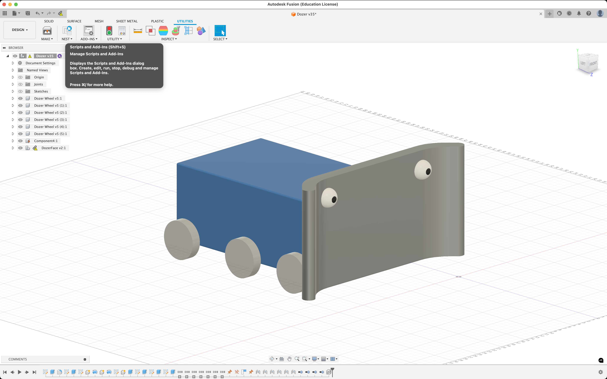
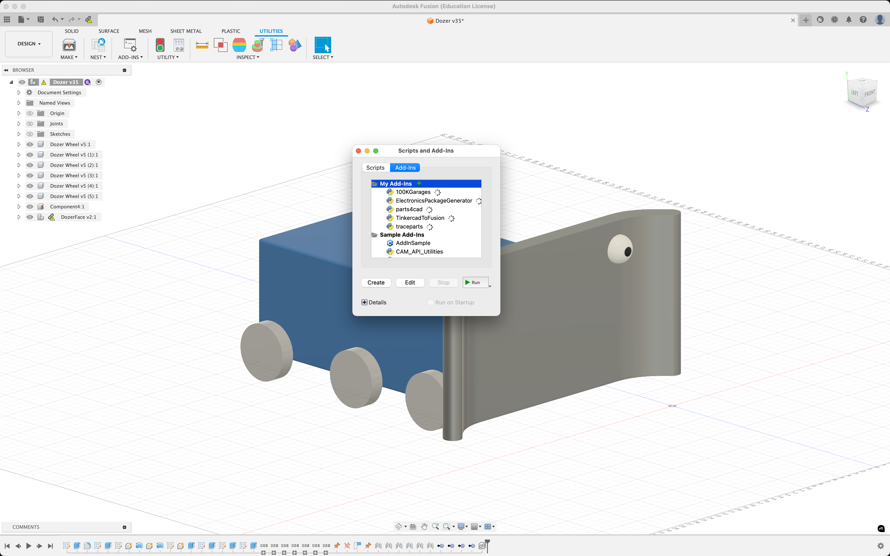
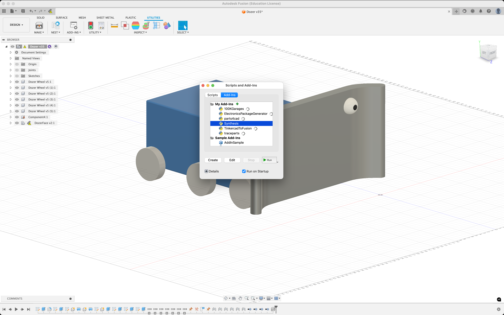
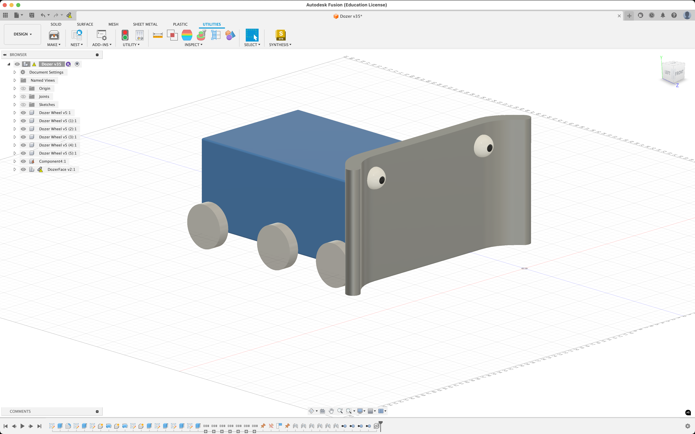

# Installing the Synthesis Fusion Exporter

## Manual Install

- Navigate to [`synthesis.autodesk.com/download`](https://synthesis.autodesk.com/download.html).
- Find the Exporter source code zip download.
  - Note that the source code is platform agnostic, it will work for **both** `Windows` and `Mac`.
- Once the source code for the Exporter is installed unzip the folder.
- Next, if not done already, install `Autodesk Fusion`.
- Once Fusion is open navigate to the `Utilities Toolbar`.

- Click on `Scripts and Add-ins` from the toolbar.

- Navigate to `Add-ins` and select the green plus icon.

- Now navigate to wherever you extracted the original `.zip` source code file you downloaded.
  - Make sure to select the folder that contains the `Synthesis.py` file, this is the entry point to the Exporter.

- Once the extension is added you should be able to see it under `My Add-Ins`.
- Select `Synthesis` from the `My Add-Ins` drop down and click `Run` in the bottom right.

- The first time you run the extension it may prompt you to restart Fusion, this is totally normal.
- Once you restart Fusion the extension will run on startup, you will be able to find it on the right side of the toolbar
under the `Utilities` tab.

Thanks for installing the Synthesis Fusion Exporter! For any additional help visit our [Synthesis Community Discord Server](https://www.discord.gg/hHcF9AVgZA) where you can talk directly to our developers.

## Using an Installer

Our automatic installer is still in development, visit the [Synthesis Discord Server](https://www.discord.gg/hHcF9AVgZA) for updates and any manual installing help.
