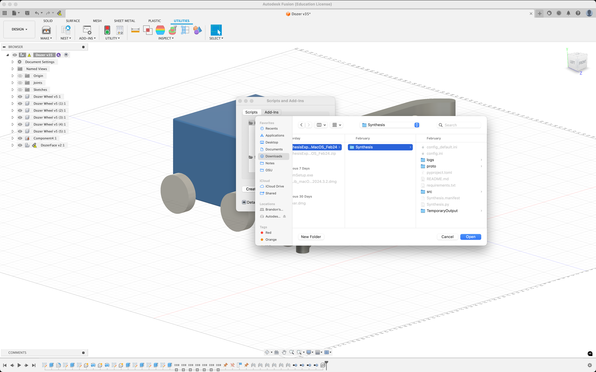

# Installers

We recently transitioned to a platform independent, web-based application. As such, we no longer maintain a installer for the core simulator. We do, however, still have one for our Fusion Exporter.

## Installing the Synthesis Fusion Exporter

### Using an Installer

- Visit [synthesis.autodesk.com/download](https://synthesis.autodesk.com/download.html) and select the installer for your operating system.
  - Note that there is no installer for Linux since Fusion is only supported on Windows and Mac.
- Once you have downloaded the installer for your operating system (`.exe` for Windows and `.pkg` for Mac) go ahead and run the executable.
  - Since we do not code sign our installers (as interns of Autodesk we have very little control over this) you may get a warning from your operating system.
  - For Mac to get around this see [this](https://support.apple.com/en-tm/guide/mac-help/mh40616/mac) guide for more information.
- If you are at all concerned that we are doing something nefarious please feel free to [install the exporter manually.](#manual-install)
  - Alternatively, you can even inspect how we build our installers [here](./exporter/) and build them yourself.

###  Manual Install

- Navigate to [`synthesis.autodesk.com/download`](https://synthesis.autodesk.com/download.html).
- Find the Exporter source code zip download.
  - Note that the source code is platform agnostic, it will work for **both** `Windows` and `Mac`.
- Once the source code for the Exporter is downloaded, unzip the folder.
- Next, if you haven't already, install `Autodesk Fusion`.
- Once Fusion is open, navigate to the `Utilities Toolbar`.

- Click on `Scripts and Add-ins` in the toolbar.

- Navigate to `Add-ins` and select the green plus icon.

- Now navigate to wherever you extracted the original `.zip` source code file you downloaded.
  - Make sure to select the folder that contains the `Synthesis.py` file, this is the entry point to the Exporter.

- Once the extension is added you should be able to see it under `My Add-Ins`.
- Select `Synthesis` from the `My Add-Ins` drop down and click `Run` in the bottom right.

- The first time you run the extension it may prompt you to restart Fusion, this is totally normal.
- Once you restart Fusion the extension will run on startup, you will be able to find it on the right side of the toolbar
under the `Utilities` tab.

Thanks for installing the Synthesis Fusion Exporter! For any additional help visit our [Synthesis Community Discord Server](https://www.discord.gg/hHcF9AVgZA) where you can talk directly to our developers.
