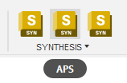
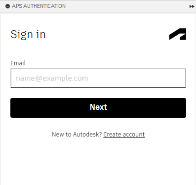
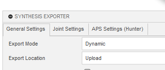
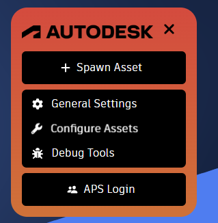
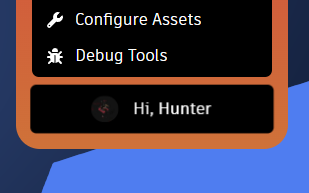
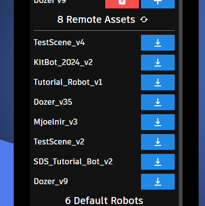

author: Synthesis Team
summary: How to use Autodesk Platform Services to store and load Synthesis assemblies.
id: APSCodelab
tags: Autodesk, APS, Autodesk Platform Services, Fusion
categories: Services
environments: Synthesis
status: Draft
feedback link: https://github.com/Autodesk/synthesis/issues

# Autodesk Platform Services

## APS (Fusion)

### Login

In order to make use of the Autodesk Platform Services (APS) integration, you first have to log in. This can be done with the middle toolbar button.

Once logged in, you'll be able to see your name in the main export panel.

### Export Option

To store an export in your current project, make sure the "Export Location" option is set to "Upload".

## APS (Synthesis)

### Login

To log into your Autodesk account, open the left menu and click on "APS Login".

Upon successful login, you should see a notification in the bottom-right, as well as a greeting and your profile picture replacing the "APS Login" button.

### Importing

Once logged in, when you open the "Spawn Asset" panel, the remote assets section will begin to search your projects and show any and all Synthesis assemblies available for importing.

After you've imported them for the first time, they will be saved for later use and won't require APS login to access so long as they stay saved in your browser.

## Need More Help?

If you need help with anything regarding Synthesis or it's related features please reach out through our
[discord sever](https://www.discord.gg/hHcF9AVgZA). It's the best way to get in contact with the community and our current developers.
