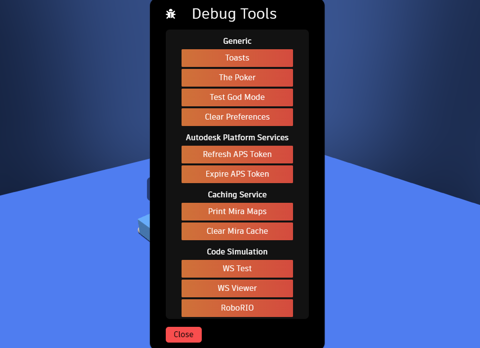
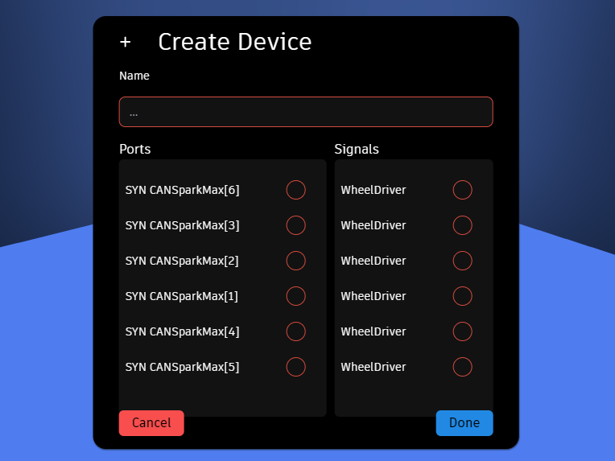
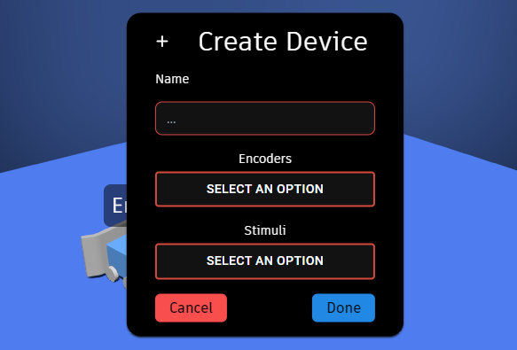

author: Synthesis Team
summary: Tutorial for simulating code in Synthesis
id: CodeSimulationCodelab
tags: WPILib, Code, C++, Java
categories: WPILib
environments: Synthesis, VSCode
status: Published
feedback link: https://github.com/Autodesk/synthesis/issues

# Code Simulation in Synthesis

## Setup (Robot Code Side)

The Synthesis simulator comes with code simulation already integrated. However, a development environment for what ever code your are trying to simulate will be required.
Synthesis' code simulation relies on the WPILib HALSim extensions, specifically the websocket-client extension. You'll need to make the following changes to your `build.gradle` in order to properly simulate your code in Synthesis.

### 1. Desktop Support

You'll need to enable desktop support for your project in order to run the HALSim:

```java
def includeDesktopSupport = true
```

### 2. Websocket Server Extension

In order to communicate with your browser, you'll need to enable the websocket server extension with the following:

```java
wpi.sim.envVar("HALSIMWS_HOST", "127.0.0.1")
wpi.sim.addWebsocketsServer().defaultEnabled = true
```

### 3. SyntheSim (Optional)

For CAN-based device support (TalonFX, CANSparkMax, most Gyros), you'll need our own library--SyntheSim. Currently only available for Java, SyntheSim adds additional support for third party devices that don't follow WPILib's web socket specification. It's still in early development, so you'll need to clone and install the library locally in order to use it:

```sh
$ git clone https://github.com/Autodesk/synthesis.git
$ cd synthesis/simulation/SyntheSimJava
$ ./gradlew build && ./gradlew publishToMavenLocal
```

Next, you'll need to have the local maven repository is added to your project by making sure the following is included in your `build.gradle` file:

```java
repositories {
  mavenLocal()
  ...
}
```

Finally, you can add the SyntheSim dependency to your `build.gradle`:

```java
dependencies {
  ...
  implementation "com.autodesk.synthesis:SyntheSimJava:1.0.0"
  ...
}
```

All of these instructions can be found in the [SyntheSim README](https://github.com/Autodesk/synthesis/blob/prod/simulation/SyntheSimJava/README.md).

SyntheSim is very much a work in progress. If there is a particular device that isn't compatible, feel free to head to our [GitHub](https://github.com/Autodesk/synthesis) to see about contributing.

### 4. HALSim GUI (Optional)

To add controller/joystick support for your robot code, you'll need to use the HALSim GUI extension. Enable by adding the following to `build.gradle`:

```java
wpi.sim.addGui().defaultEnabled = true
```

It's very likely that this is already enabled.

## Setup (Synthesis Web-app Side)

**WARNING**: Our web-app's UI for configuring the robot is very much a work in progress and only available in the debug tools.

First, you'll want to start the simulation of your robot code. This can be done with the following command:

```bash
$ ./gradlew simulateJava
```

or for C++:

```bash
$ ./gradlew simulateNative
```

### Enabling WebSockets



Inside the debug tools panel, configure the robot in the scene to use web socket control by pressing the "WS Test" button.

You can use the "WS Viewer" to view the raw signals we are receiving from your robot code.

### Configuring your IO Map

Next, press the "RoboRIO" button. This will open the RoboRIO Configuration panel, where you'll be able to map the signals from your robot code to Synthesis drivers and stimuli.

#### Motorcontrollers

Motorcontrollers can be configured with either PWM or CAN (if using SyntheSim). On the left it will populate with ports currently active from your robot code, and on the right it will populate with drivers that be controlled, along with a name at the top.



#### Encoders

You can select a given input device created by your robot code, and map it to a corresponding stimuli inside of Synthesis (ie. one of your wheels).



#### Digital IO, Analog IO, and Gyros

These are currently being developed. See [this pull-request](https://github.com/Autodesk/synthesis/pull/1103) for status updates regarding their support.

## Need More Help?

If you need help with anything regarding Synthesis or it's related features please reach out through our
[discord server](https://www.discord.gg/hHcF9AVgZA). It's the best way to get in contact with the community and our current developers.
