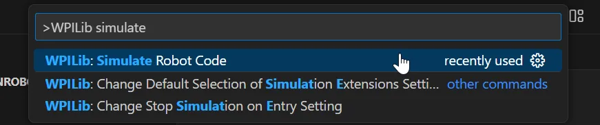
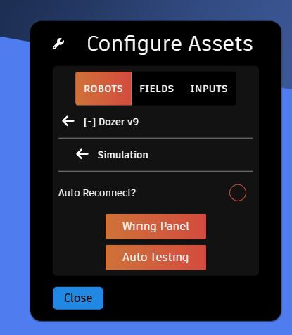
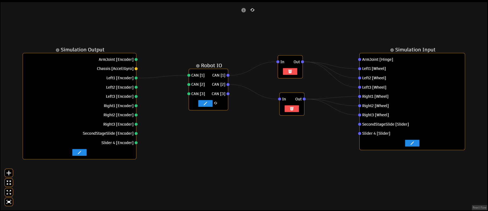
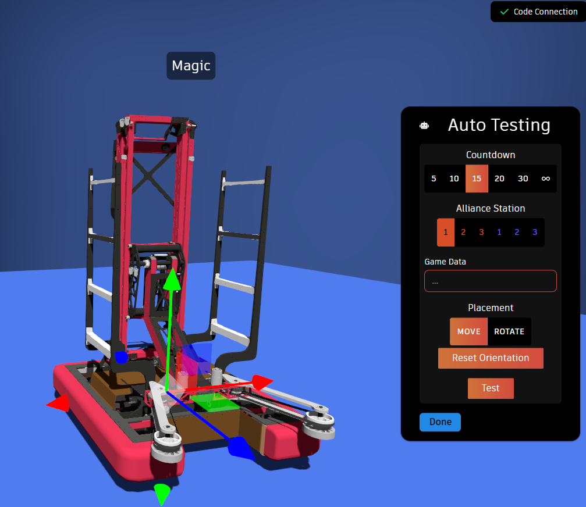

author: Synthesis Team
summary: Tutorial for simulating code in Synthesis
id: CodeSimulationCodelab
tags: WPILib, Code, C++, Java
categories: WPILib
environments: Synthesis, VSCode
status: Published
feedback link: https://github.com/Autodesk/synthesis/issues

# Code Simulation in Synthesis

## Setup (Robot Code)

The Synthesis simulator comes with code simulation already integrated. However, a development environment for the code you are trying to simulate will be required. Synthesis' code simulation relies on the WPILib HALSim extensions&mdash;specifically the WebSocket-client extension. You'll need to make the following changes to your `build.gradle` to connect everything properly.

### C++/Java

#### 1. Desktop Support

You'll need to enable desktop support for your project in order to run the HALSim:

```java
def includeDesktopSupport = true
```

#### 2. WebSocket Server Extension

In order to communicate with your browser, you'll need to enable the WebSocket server extension with the following:

```java
wpi.sim.addWebsocketsServer().defaultEnabled = true
```

#### 3. SyntheSim (Optional)

For CAN-based device support (TalonFX, CANSparkMax, most Gyros), you'll need our SyntheSim library. Although currently only available for Java, SyntheSim adds additional support for third-party devices that don't follow WPILib's WebSocket specification. It's still in early development, so you'll need to clone and install the library locally in order to use it:

<!-- TODO: clone only synthesim instead of whole repo? -->

```sh
$ git clone https://github.com/Autodesk/synthesis.git
$ cd synthesis/simulation/SyntheSimJava
$ ./gradlew build && ./gradlew publishToMavenLocal
```

Next, you'll need to ensure that the local Maven repository is added to your project by verifying that the following is included in your `build.gradle` file:

```java
repositories {
  mavenLocal()
  ...
}
```

Finally, you can add the SyntheSim dependency to your `build.gradle`:

```java
dependencies {
  ...
  implementation "com.autodesk.synthesis:SyntheSimJava:1.0.0"
  ...
}
```

> [!NOTE]
> All of these instructions can be found in the [SyntheSim README](https://github.com/Autodesk/synthesis/blob/prod/simulation/SyntheSimJava/README.md).

SyntheSim is very much a work in progress. If there is a particular device that isn't compatible, feel free to head to our [GitHub](https://github.com/Autodesk/synthesis) to see about contributing.

#### 4. HALSim GUI

Verify that the following is included in your `build.gradle`&mdash;it should be added by default.

```java
wpi.sim.addGui().defaultEnabled = true
```

This will allow you to change the state of the robot, as well as connect any joysticks you'd like to use during TeleOp. You must use this GUI in order
to bring your robot out of disconnected mode, or else it won't be possible to change the state of your robot from within the app.

#### 5. Start your code

To start your robot code, you can use the following simulate commands with Gradle:

```bash
$ ./gradlew simulateJava
```

or for C++:

```bash
$ ./gradlew simulateNative
```

WPILib also has a command from within VSCode you can use the start your robot code:



### Python

#### 1. Install dependencies

Add the 'sim' component to `robotpy_extras` in your `pyproject.toml`:

```toml
[tool.robotpy]

robotpy_version = ...

robotpy_extras = [
  # other components here
  "sim",
]
```

Run `python -m robotpy sync` to install the needed packages.

#### 2. Start your code

To start your code, you can run the following:

```
python -m robotpy sim --ws-server
```

## Working with Hardware Components

Once your simulation is running, you can control various robot components just like you would on a physical robot.

### Motors

#### PWM Motors

Standard servo and speed controller motors work right out of the box with WPILib's built-in simulation support.

```java
private Spark m_leftMotor = new Spark(0);  
private Spark m_rightMotor = new Spark(1);  

public void teleopPeriodic() {
    double forward = -m_Controller.getLeftY();
    double turn = m_Controller.getRightX();
    
    m_leftMotor.set(forward + turn);
    m_rightMotor.set(forward - turn);
}
```

#### CAN Motors
For advanced motors like TalonFX or CANSparkMax, you'll need to have SyntheSim installed.

```java
// Import from SyntheSim, not vendor libraries
import com.autodesk.synthesis.revrobotics.CANSparkMax;
import com.autodesk.synthesis.ctre.TalonFX;
import com.revrobotics.CANSparkLowLevel.MotorType;

private CANSparkMax m_driveLeft = new CANSparkMax(1, MotorType.kBrushless);
private CANSparkMax m_driveRight = new CANSparkMax(2, MotorType.kBrushless);
private TalonFX m_shooter = new TalonFX(7);

public void autonomousPeriodic() {
    m_driveLeft.set(0.5);
    m_driveRight.set(-0.5);
    
    double position = m_driveLeft.getEncoder().getPosition();
    if (position >= 20) {
        m_driveLeft.set(0.0);  
    }
}
```

### Gyroscopes and Accelerometers

#### NavX and AHRS devices

```java
// Regular NavX library is okay
import com.kauailabs.navx.frc.AHRS;
import edu.wpi.first.wpilibj.SPI;

private AHRS m_gyro = new AHRS();

public void autonomousPeriodic() {
    double currentAngle = m_gyro.getAngle();      
    double pitch = m_gyro.getPitch();            
    double roll = m_gyro.getRoll();             
    double yaw = m_gyro.getYaw();                
    
    double targetAngle = 90.0;
    double error = targetAngle - currentAngle;
    double turnSpeed = error * 0.02;
    
    m_driveLeft.set(-turnSpeed);
    m_driveRight.set(turnSpeed);
}
```

#### Acceleromoter simulation
For detecting impacts, measuring tilt, or monitoring acceleration:

```java
// Import from SyntheSim
import com.autodesk.synthesis.wpilibj.ADXL362;

private ADXL362 m_accelerometer = new ADXL362(SPI.Port.kMXP, ADXL362.Range.k8G);

public void robotPeriodic() {
    double xAccel = m_accelerometer.getX(); 
    double yAccel = m_accelerometer.getY();  
    double zAccel = m_accelerometer.getZ();

    if (Math.abs(xAccel) > 0.5 || Math.abs(yAccel) > 0.5) {
        System.out.println("Warning: Robot is tilting!");
    }
}
```

### Cameras and Vision

**Camera simulation** in Synthesis uses a WebSocket bridge to stream real-time 3D rendered frames from the simulator to your robot code. The example code allows camera stream in Shuffleboard:

```java
import edu.wpi.first.cameraserver.CameraServer;
import edu.wpi.first.cscore.CvSource;
import com.autodesk.synthesis.Camera;
import com.autodesk.synthesis.CameraFrameHandler;
import com.autodesk.synthesis.WebSocketMessageHandler;
import com.autodesk.synthesis.SynthesisWebSocketServer;

private Camera m_Camera = new Camera("USB Camera 0", 0);
private CvSource m_videoSource;

@Override
public void simulationInit() {
    System.out.println("🚀 Starting WebSocket server for Synthesis communication...");
    SynthesisWebSocketServer.getInstance().startServer();
    
    m_Camera.setConnected(true);
    m_Camera.setWidth(640);
    m_Camera.setHeight(480);
    m_Camera.setFPS(30);
    
    // Create custom video source. WPILib handles all the streaming!
    m_videoSource = CameraServer.putVideo("Synthesis Camera", 640, 480);
    
    // Register camera with frame handler to receive frames from simulation
    CameraFrameHandler.getInstance().registerCamera("USB Camera 0", m_videoSource);
}

@Override
public void simulationPeriodic() {
    boolean cameraConnected = m_Camera.isConnected();
    double cameraWidth = m_Camera.getWidth();
    double cameraHeight = m_Camera.getHeight();
    double cameraFPS = m_Camera.getFPS();
    
    // Use camera data here
}
```

## Setup (Simulator)

Once started, make sure in the SimGUI that your robot state is set to "Disabled", **not** "Disconnected".

### Spawning in a Robot

Head over to [Fission](https://synthesis.autodesk.com/fission/) and load your robot model into the simulation. Once it appears, place it on the field and open the configuration panel, either through the left sidebar menu or by right-clicking your robot and selecting "Configure."

In order to configure your robot to use code simulation, you need to switch the robot's "brain" from "Synthesis" to "WPILib", which tells the simulator to receive inputs from the simulated code rather than from keyboard or controller inputs.

The indicator in the top-right corner of the screen will display the status of the connection between Synthesis and the simulator.

### Simulation Configuration

Once you've switched to the WPILib brain, a new "Simulation" section will appear in your robot's config panel.



#### Auto Reconnect

This setting configures Synthesis to automatically attempt to reconnect when connection is lost, and will stay configured the next time you open Synthesis.

#### Wiring Panel

The wiring panel shows all available inputs and outputs from both your running code and the simulated robot hardware. Each connection point (the small labeled circles) is color-coded by data type: analog signals, digital I/O, PWM outputs, etc.



The controls in the bottom-left of the panel can be used to zoom, auto-fit the view, and add junction nodes when you need to split one signal to multiple destinations.

#### Auto Testing

The Auto Testing panel can be used to easily reset your robot's state for rapid autonomous testing.



Set your maximum test time, choose your alliance station, and input any game-specific data your autonomous routine needs. Position your robot exactly where you want it to start, then press the start button to begin your autonomous routine.

When the timer elapses or the test is manually stopped, you're provided the option to reset the robot for another test.

## Video Walkthrough

Watch the video below to walk through setting up code simulation with SyntheSim.

## Need More Help?

If you need help with anything regarding Synthesis or it's related features please reach out through our
[Discord server](https://www.discord.gg/hHcF9AVgZA). It's the best way to get in contact with the community and our current developers.
