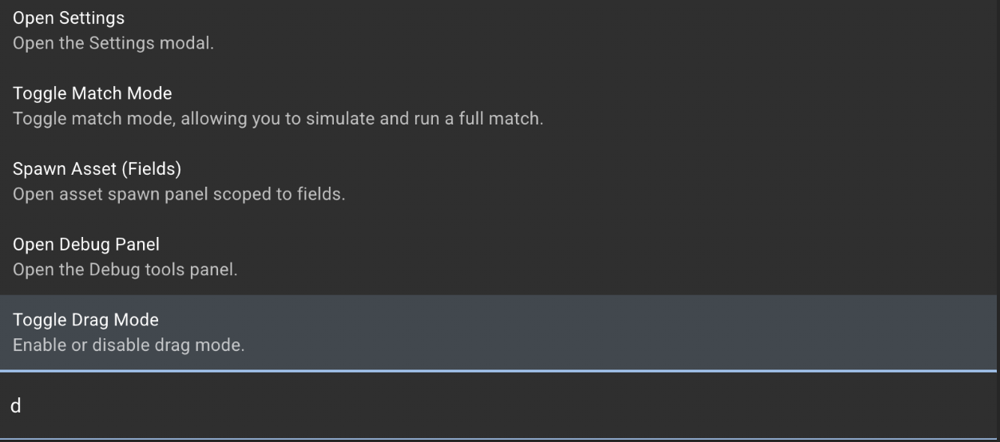

author: Synthesis Team
summary: Tutorial for using the Command Palette within the simulator.
id: CommandPalette
tags: Customization, Navigation, Panels, Modals
categories: Navigation
environments: Synthesis
status: Draft
feedback link: https://github.com/Autodesk/synthesis/issues

## Overview

The Command Palette in Synthesis is a tool that lets you quickly access and execute various functions without navigating through multiple panels.

## Usage

To open the command pallet, press the “/” key.

Start typing the command you're looking for, and a list of suggested commands will appear.

You can either click on the desired command or use the arrow keys to navigate through the list. Press Enter to run the selected command. Press Esc to exit the palette without running any commands.

## All Synthesis Commands (v7.2.0)

### Match & Drag

- **Toggle Drag Mode** — Enable/disable drag mode to move robots and game pieces  
- **Toggle Match Mode** — Start or stop a match  

### Assets

- **Spawn Asset Robots** — Open robot spawn panel  
- **Spawn Asset Fields** — Open field spawn panel  
- **Configure Assets** — Open configure assets panel  
- **Configure Robots** — Open configure assets panel (robot tab)  
- **Configure [NAME]** — Configure a spawned robot/field with the given name  
- **Remove [NAME]** — Remove a spawned robot/field with the given name  

### Panels

- **Open Debug Panel** — Open the debug panel  
- **Open Settings** — Open the settings panel  

## Need More Help?

If you need help with anything regarding Synthesis or it's related features please reach out through our
[Discord](https://www.discord.gg/hHcF9AVgZA). It's the best way to get in contact with the community and our current developers.
