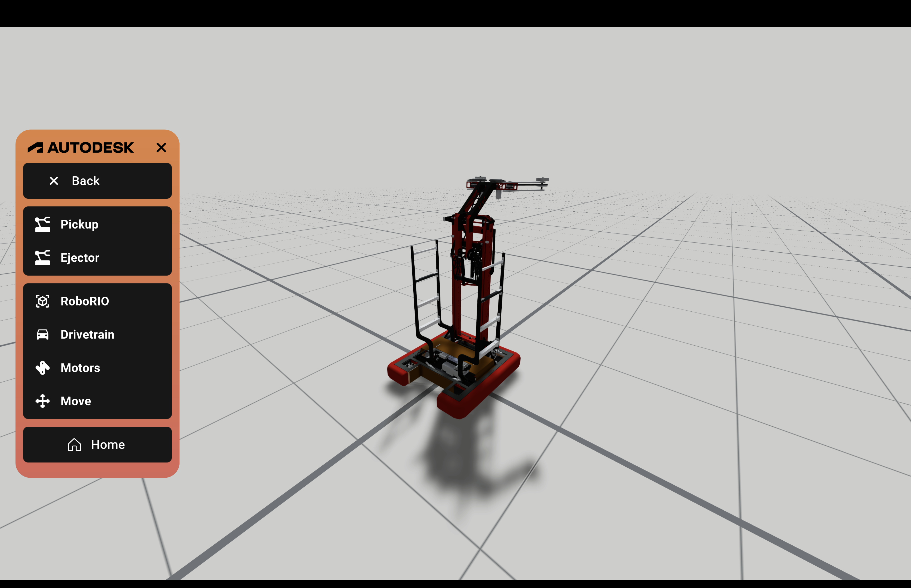
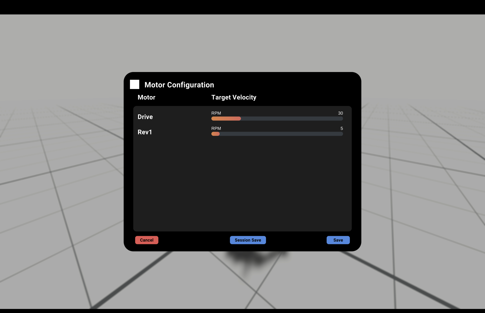
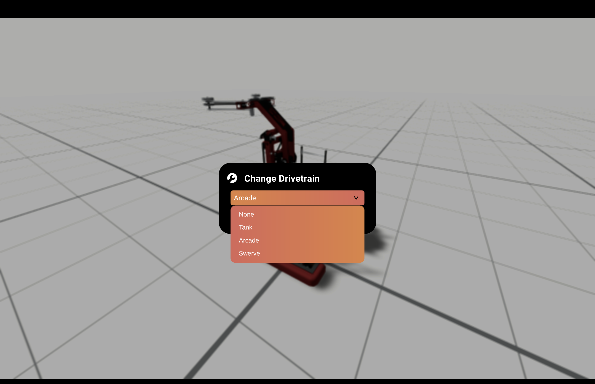

author: Synthesis Team
summary: Tutorial for using Config Mode
id: ConfigModeCodelab
tags: Config, Robot Config, Game Simulation
categories: Modes
environments: Synthesis
status: Draft
feedback link: https://github.com/Autodesk/synthesis/issues

# Robot Config Mode in Synthesis

## Intro

Configure Mode allows you to change and fine tune aspects of your robot to better test and simulate its behavior on the field. Configure Mode is available in both Practice and Match Modes and is accessible via the side panel.

In each configuration panel, you will be able to cancel and save your modifications. You will also be given the option to `Session Save`, saving your changes until you quit the session. If you want the changes you make to that robot to be saved permanently, hit the `Save` button on the far right.

## Intake and Outtake

### Pickup

The first option in Configuration Mode allows you to adjust your intake. You can move the pickup zone in three dimensions and adjust the zone size using the configure panel on the side. By changing the zone size, you can adjust how much room your robot has to intake game pieces.

**Grounding**: You can select a part of your robot to attach your pickup zone to.

### Ejector

Similarly to pickup configuration, you’re able to move your ejection path in three dimensions and ground the ejector to a specific part on the robot. You can also rotate your ejection path and adjust the speed the game piece is shot.

## Motors

Motor configuration allows you to modify the motors on your robot. Using the slide bars assigned to each motor, you can adjust the target velocity accordingly.

Pictured here are the motors on Team 2471's 2018 robot.

**RPM**: Revolutions per minute, standard unit used to measure speed of drivetrains.
**M/S**: Meter per second, standard unit of both speed and velocity.

## Drivetrain

In drivetrain configuration, you can change the drivetrain your robot uses, which can then be adjusted in motor configuration and controls.

The drivetrains available on Synthesis are as the following:

* **None**: Selecting ‘None’ will disable your robot’s drive.
* **Tank**: A direct-drive control where each joystick is used for one side of the drivetrain
* **Arcade**: A control scheme in which one single joystick controls both the robot’s forward and backward movement, as well as its turning.
* **Swerve**: A specialized drivetrain that allows each wheel to move and rotate independently.

### Compatibility

Not all drivetrains can be equipped by every model. Swerve drive especially is not compatible with robots that haven’t specifically been made to use it.

## Need More Help?

If you need help with anything regarding Synthesis or it's related features please reach out through our
[discord sever](https://www.discord.gg/hHcF9AVgZA). It's the best way to get in contact with the community and our current developers.
