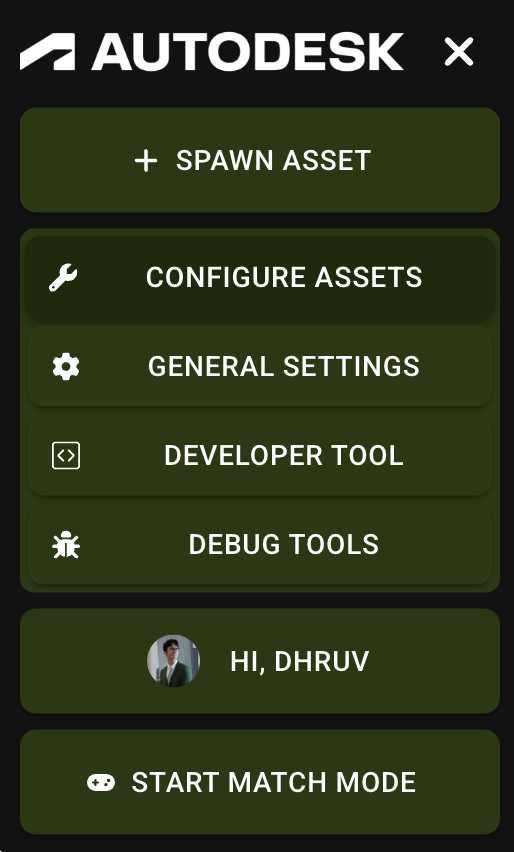
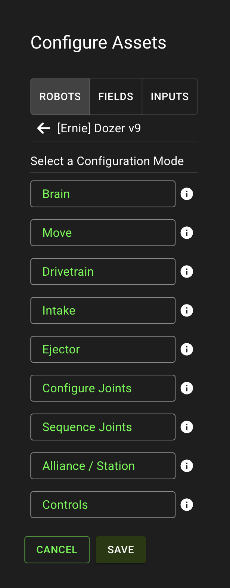
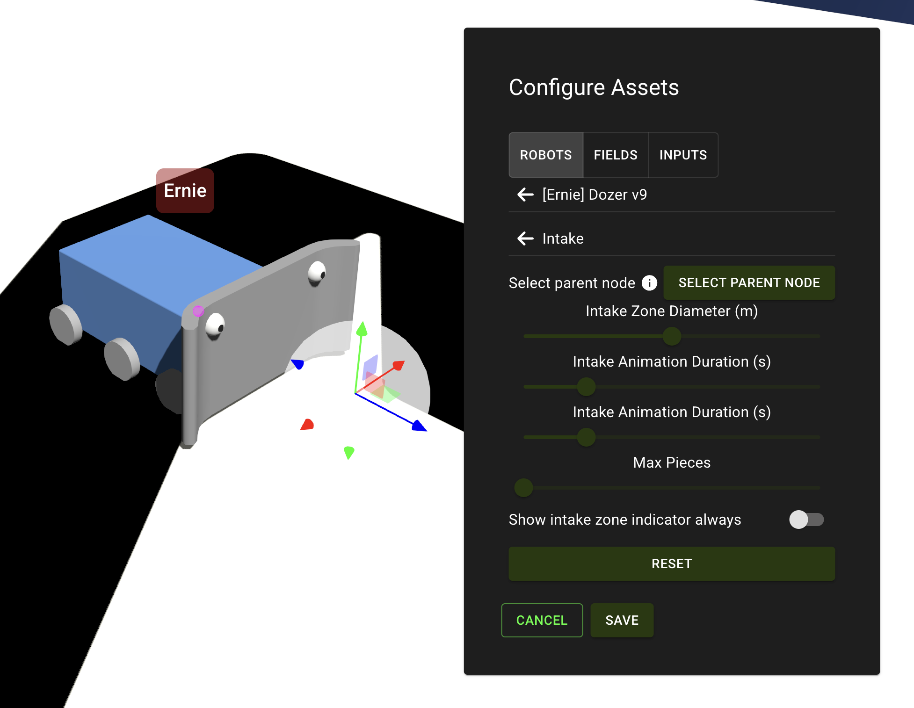
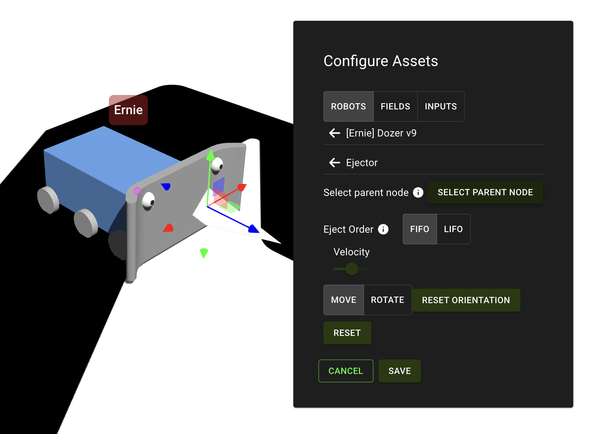
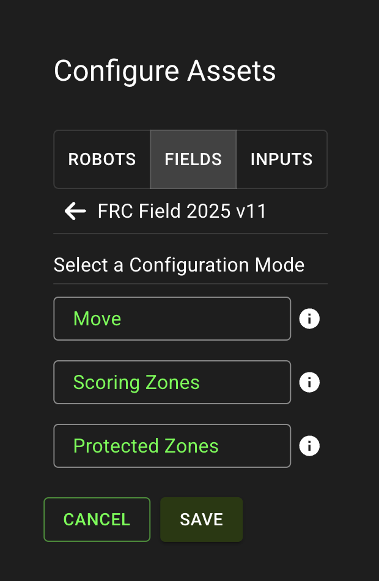
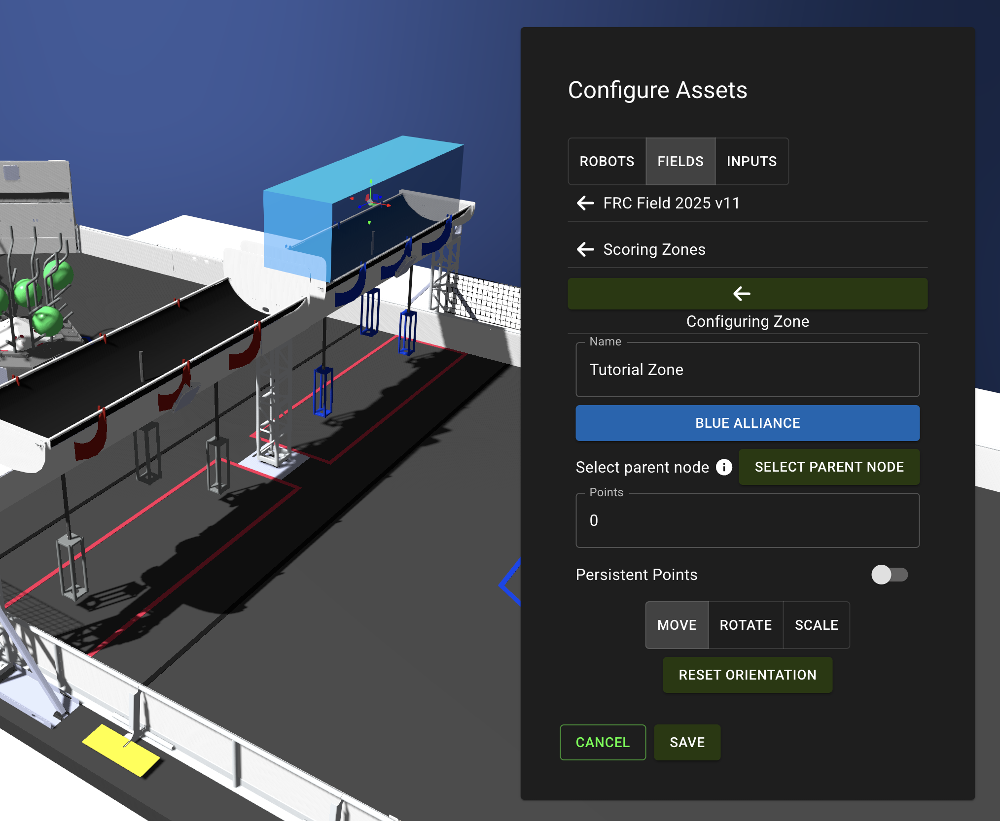

author: Synthesis Team
summary: Tutorial for navigating and using the configure assets panel.
id: ConfigureAssets
tags: Configuration, Assets, Options, Customization
categories: Configuration
environments: Synthesis
status: Draft
feedback link: https://github.com/Autodesk/synthesis/issues

# Configure Assets

## Abstract

The configure assets panels allows you to change the ways assemblies interact with each other and how they are simulated. In this panel, you can:
- Add intakes and ejectors to robots
- Configure scoring zones for fields
- Adjust the speed of robots
- Set the alliance / station of robots
- And more...

You can open this panel from the sidebar

## Robots

### Brain

The brain determines where the robot receives its inputs from.
There are currently two options, "Synthesis" and "WPILib".

### Move

Adds a gizmo tool to your robot to move or rotate it.

### Intake

The intake zone config allows you to configure the intake zone for your robot.
You can select a parent node for the intake zone to have it follow a manipulator automatically by clicking the <kbd>Select Parent Node</kbd> button and then clicking on the manipulator on your robot.
If you want the intake zone to display all the time (rather than just when configuring it), you can enable the "Show intake zone indicator always" checkbox.

> [!NOTE]
> This setting is required to be able to intake a gamepiece.

### Ejector

The ejector config allows you to modify the ejector settings, which defines where a gamepiece is stored upon intake and the direction and velocity at which it is ejected.
You can change the eject order when storing multiple gamepieces between FIFO (first in first out) and LIFO (last in first out).
You can also select a parent node for the ejector so it can follow a manipulator automatically.

> [!NOTE]
> This setting is also required to be able to intake gamepieces.

### Configure Joints

Allows you to edit the joints on your robot and adjust the speed and force behind them.
Debugging: if your robot moves very slowly, reconfigure your exporter settings or alternatively change the velocity of the wheel joints.

### Sequence Joints

Lets you configure joints to work together (e.g. tell a motor to follow another).
This is helpful for multi-stage elevators.

### Controls

Change the controls of the input scheme currently in use, as well as switch which scheme is actively in use. Tutorials for configuring schemes are in the "Spawn Asset" tutorial.

> [!NOTE]
> This option is only available when using the "Synthesis" brain.

### Simulation

Modify the relation between your robot within Synthesis and your code.
> [!NOTE]
> This option is only available when using the "WPILib" brain.

## Fields

### Move

Adds a gizmo tool to the field to move or rotate it.

### Scoring Zones

If a game piece enters a scoring zone, the team scores a point. Using the scoring zones panel, you can add, position, and delete these zones.

<!-- TODO: rename persistent points -->
Enabling persistent points will require a game piece to stay in the zone for the point to count. If the game piece leaves, the points will be lost.
These can also be configured to have a parent node so they follow a moving field element.

### Protected Zones

Configure the position of protected zones to issue penalties to a team if one of their robot enters the zone.
This can be used in instances where entering a specific area of the field (e.g. scoring area, starting area, etc.) would incur a point penalty.

## Inputs

This works the same as the controls section for the robot. You can modify the controls for the schemes, as well as add and delete them.

## Video Walkthrough

Watch the video below to walk through configuring your assemblies.

<video id="hHf-7Ojl-fE"></video>

## Need More Help?

If you need help with anything regarding Synthesis or it's related features please reach out through our
[Discord](https://www.discord.gg/hHcF9AVgZA). It's the best way to get in contact with the community and our current developers.
