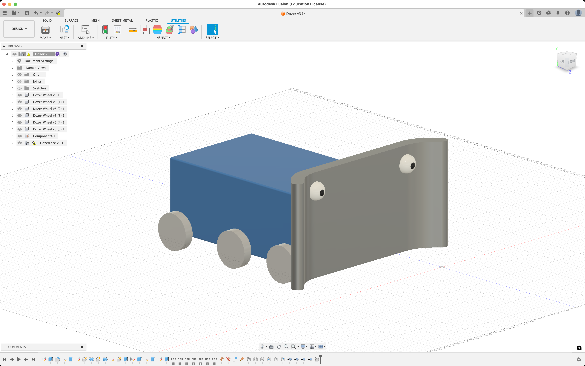
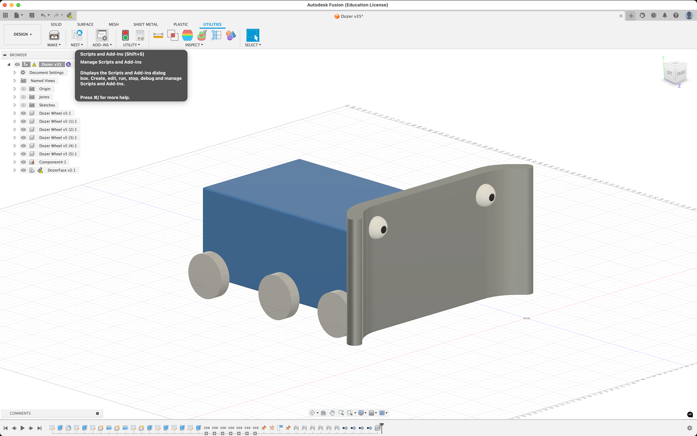
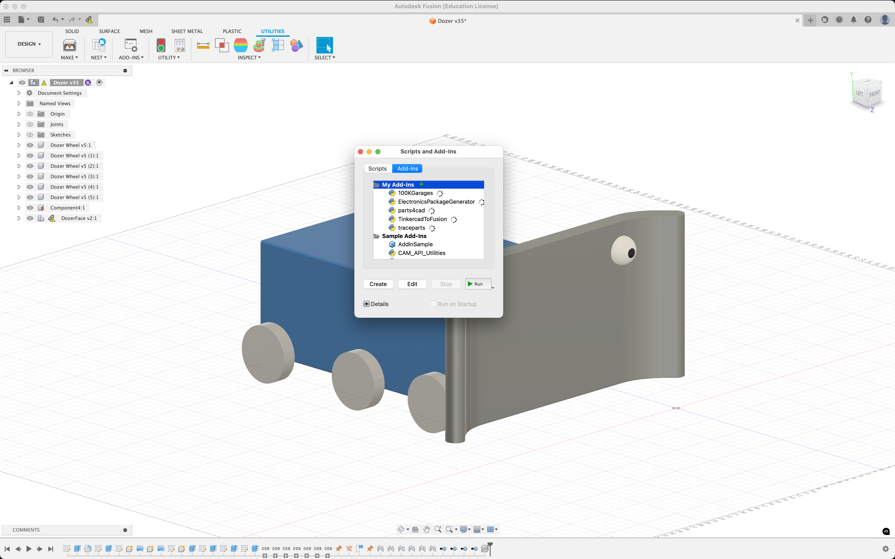
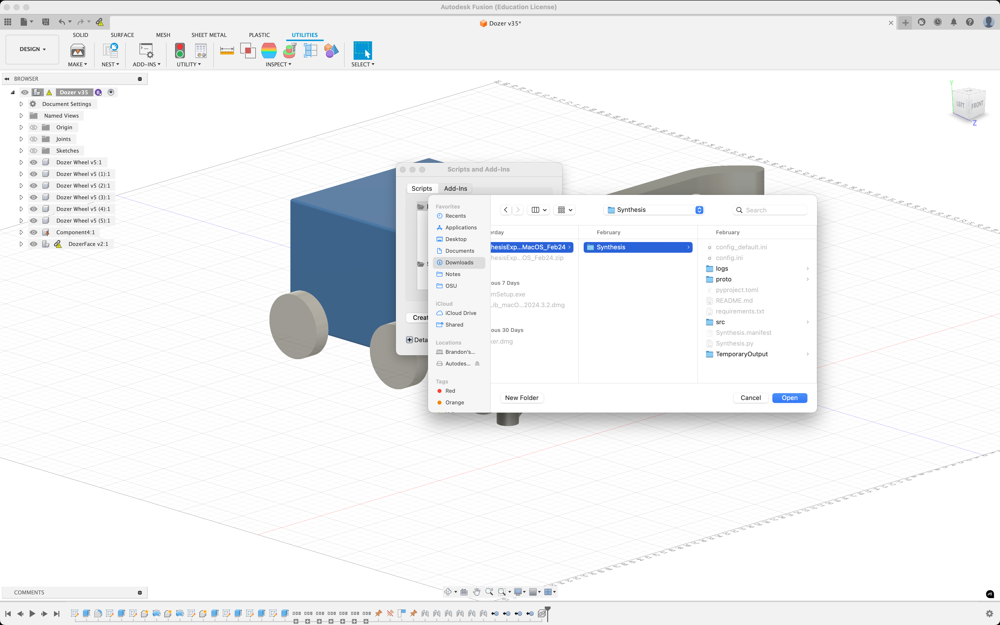
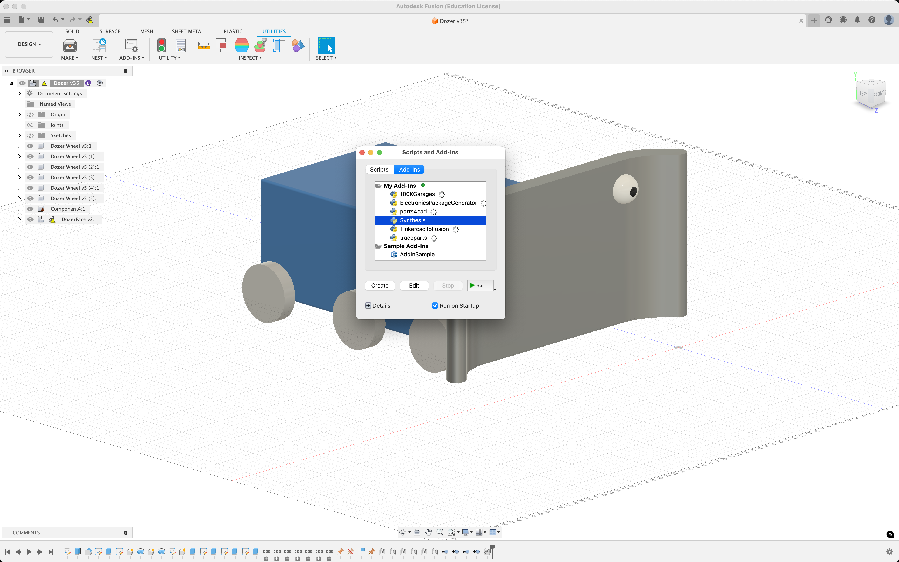
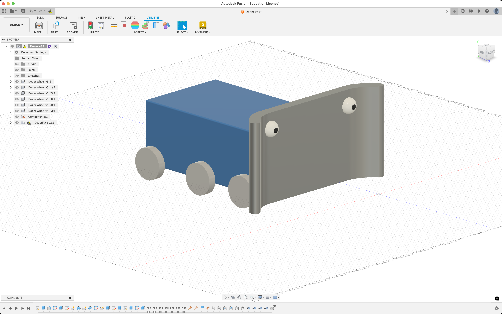
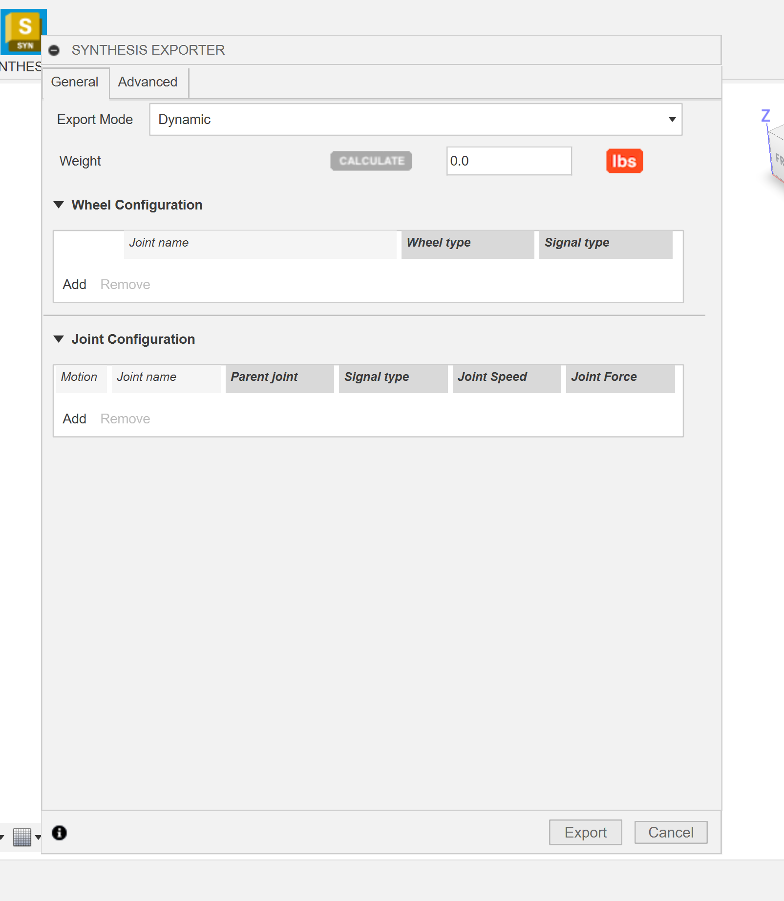
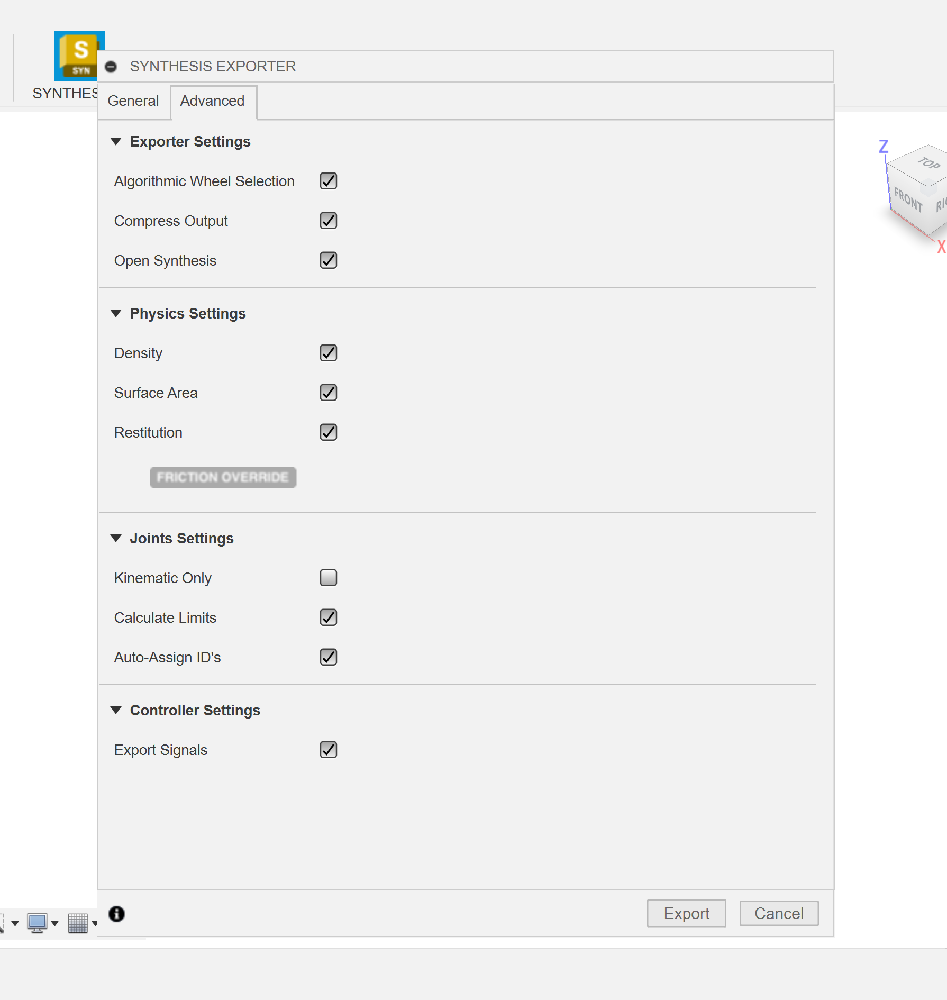

author: Synthesis Team
summary: Tutorial for using Fusion exporter
id: FusionExporterCodelab
tags: Python, Exporter, CAD
categories: Python, CAD
environments: Autodesk Fusion
status: Draft
feedback link: https://github.com/Autodesk/synthesis/issues

# Synthesis Fusion Exporter Addin

## Getting Started

The Synthesis Fusion exporter is the tool used by both developers and users to export their CAD models into the Synthesis simulator. The exporter installer and manual installation material can be found at our [downloads page](https://synthesis.autodesk.com/download.html).

### Manual Install

- Navigate to [`synthesis.autodesk.com/download`](https://synthesis.autodesk.com/download.html).
- Find the Exporter source code zip download.
  - Note that the source code is platform agnostic, it will work for **both** `Windows` and `Mac`.
- Once the source code for the Exporter is downloaded unzip the folder.
- Next, if you haven't already, install `Autodesk Fusion`.
- Once Fusion is open, navigate to the `Utilities Toolbar`.

- Click on `Scripts and Add-ins` in the toolbar.

- Navigate to `Add-ins` and select the green plus icon.

- Now navigate to wherever you extracted the original `.zip` source code file you downloaded.
  - Make sure to select the folder that contains the `Synthesis.py` file, this is the entry point to the Exporter.

- Once the extension is added you should be able to see it under `My Add-Ins`.
- Select `Synthesis` from the `My Add-Ins` drop down and click `Run` in the bottom right.

- The first time you run the extension it may prompt you to restart Fusion, this is totally normal.
- Once you restart Fusion the extension will run on startup, you will be able to find it on the right side of the toolbar
under the `Utilities` tab.

### Using an Installer

Our automatic installer is still in development, visit the [Synthesis Discord Server](https://www.discord.gg/hHcF9AVgZA) for updates and any manual installing help.

### Launching the Exporter

After clicking the button, a panel will open up. This is the exporter. In this panel, you can provide us with most of the extra data we need to properly simulate your robot or field in Synthesis.

## Usage

### Toolbar Buttons

Core panel

APS Login

The last toolbar button opens Synthesis for you.

## Core Panel

### General Tab

This is where you will do most of your configuring. Here is a basic overview of the options you will find in the general tab.

- Export Mode:
  - **Dynamic**: This exports in the robot mode. General means the object will be completely movable by default.
  - **Static**: This exports in the field mode. Fields are essentially non-controllable robots with a fixed grounded node.
- Weight:
  - The weight of your exported model. This is used for physics calculations within Synthesis, however, it does not need to be exact. If you happen to know the real world weight of your robot put that here. Otherwise click the `Calculate` button to have the exporter estimate the weight for you.
  - Note: The weight can either be measured in `lbs` or `kgs`.
- Wheel Configuration:
  - This is where you will select all of your drivetrain wheels on your robot.
  - Use the wheel type to decide between standard or omni wheels (mecanum drive can be used with either in the engine)
  - Change the signal type of the joint (PWN, CAN for simulation. Passive to not be controlled)
- Joint Configuration:
  - This is where you will select all other moving joints on your robot that are not a part of your drivetrain. All joints are automatically added to this list. If you want to remove it either suppress it, or manually remove it from the list.

Notes:

- All parts of your robot that you want to be movable must be a part of a joint. Otherwise the exporter will automatically attempt to ground the part. This is the cause for many problems relating to robots not moving expectedly.
- When selecting your joints it is important that your robot is structured correctly. See [Design Hierarchy](#tips-on-design-hierarchy) for more information.
- Signal type specifies what type of IO is used to control the wheel. This is needed for code emulation.

### Advanced Tab

The advanced tab has some optional toggles for disabling / enabling some more advanced features. If your not confident in your ability with the Synthesis exporter, it is recommended that you leave these options alone.

- Exporter Settings:
  - **Algorithmic Wheel Selection**: Automatically selects similar wheels when a wheel is picked (default on)
  - **Compress Output**: Compress Output: Compresses resulting mirabuf file with GZip (default on)
  - **Open Synthesis**: Open Synthesis: Opens Synthesis when the export is finished (default on)
- Physics Settings:
  - **Density**: Optionally, include density in mirabuf file (default on)
  - **Surface Area**: Optionally, include surface area in mirabuf file (default on)
  - **Restitution**: Optionally, include restitution data in mirabuf file (default on)
  - **Friction Override**: Manually set a friction level for the entire mirabuf file (default 0.5)
- Joints Settings:
  - **Kinematic Only**: Makes the dynamic export only kinematic (no forces acting on it, only contraint solving) (default off)
  - **Calculate Limits**: Includes joint limits in the mirabuf file (default on) 
  - **Auto-Assign ID's**: Automatically assigns ID's to the joints (default on)
- Controller Settings:
  - **Export Signals**: Include signal ID's with joints and a SignalMap (default on)

Note that some of these features are currently still experimental and may not be working or behave as expected.

## APS Login

## Tips on Design Hierarchy

Synthesis not only relys on the joints between parts to determine structure of your robot or field, but also the hierarchy of all the parts in the design. If you look at the browser, you can see the parent child relation ship between all our your parts, and it is important that you have them set correctly in order to ensure Synthesis knows your intentions.

Problems associated with incorrect design hierarchy account for the majority of issues users have with the exporter. It's extremely important to plan out your robot structure before you begin.

The term node refers to a collection of parts that **don't** move relative to eachother.

### Basic Rules

Below is a basic overview of the design hierarchy rules that the exporter expects your CAD model to follow. It is possible to export a robot without following any of these rules, however, your model will likely not behave as expected once in the simulator.

#### 1. Grounded Node

You must ground one of your parts in the design. This tells Synthesis where to start branching off the rest of the nodes from. In the browser, you'll see there is a main root component. All other components under this root component will actually be used in the export. **NOTE**: Generally anything that is *underdefined* or *"disjointed"* from the rest of the design will be added under the main grounded object, so if objects that are supposed to be moving relative to what you define as grounded aren't, that is likely why.
All child components of the component that is grounded (and disjointed components) will be attached to the grounded node. If a component is associated with any joint (rigidgroups are a big exception here) will not be attached to the grounded. Instead, they will start creating their own node. As a result, if you joint two child components together, it will create those components (and their children) as completely separate objects in Synthesis. You will need to specify which component in the joint should remain with the grounded node.

#### 2. Rigidgroups

Rigidgroups act as a bandage. They ensure that whatever components are within the rigidgroup exist in the same node. Use this to ensure which side of the joint should remain in the grounded joint.

#### 3. Sub-joints

You can follow the same logic as the grounded node, but instead its stemming from that parented joint.

## Need More Help?

If you need help with anything regarding Synthesis or it's related features please reach out through our
[discord sever](https://www.discord.gg/hHcF9AVgZA). It's the best way to get in contact with the community and our current developers.
