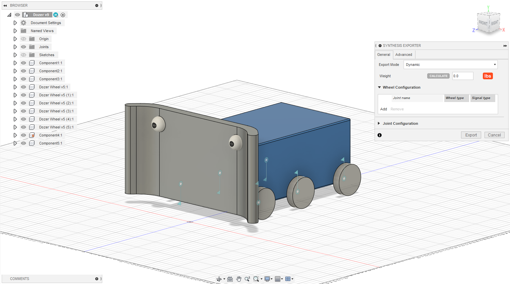
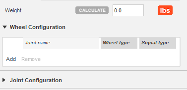

author: Synthesis Team
summary: Tutorial for using Fusion360 exporter
id: FusionExporterCodelab
tags: Python, Exporter, CAD
categories: Python, CAD
environments: Fusion360
status: Published
feedback link: https://github.com/Autodesk/synthesis/issues

# Synthesis Fusion 360 Exporter Addin

## Intro

After installing Synthesis, the exporter addin should automatically start up when you open Fusion360. Navigate to the Utilities tab and you should see a Synthesis button.

After clicking the button, a panel will open up. This is the exporter. In this panel, you can provide us with most of the extra data we need to properly simulate your robot or field in Synthesis.

### General Tab

The general tab is where you'll do most of the configuring.
The first option in the general tab is the `Export Mode`

**Dynamic** -> This exports in the robot mode. General means the object will be completely movable by default\
**Static** -> This exports in the field mode. Fields are essentially non-controllable robots with a fixed grounded node.

### Advanced Tab

The advanced tab has some optional toggles to disable/enable some features.

## Robots

### Weight

Click the `Calculate` button to automatically calculate the weight. This uses the physical material and calculated volume of each object to determine the realistic weight and center of mass of the Assembly.
The default physical material is steel so if your robot is heavier than expected, check the physical materials that are being used.
You can also specify a total weight for your robot to override the calculated one.

### Wheel Configuration

If your robot has a drivetrain, you'll need to add the joints for the wheels. Click the `Add` button, then either click the joint in the main 3D viewer or find it in the browser on the left. You can remove wheels by selecting the joint you wish to remove and clicking the `Remove` button.

You can specify a wheel type (however, currently only standard is supported).

The signal type specifies what type of IO is used to control the wheel. This will be used when user control via custom code is reintegrated.

### Joint Configuration

You can configure each type joint that will be used in the robot. All joints are automatically added to the list. If you want to ignore a joint you can either supress it, or remove it from the list.
