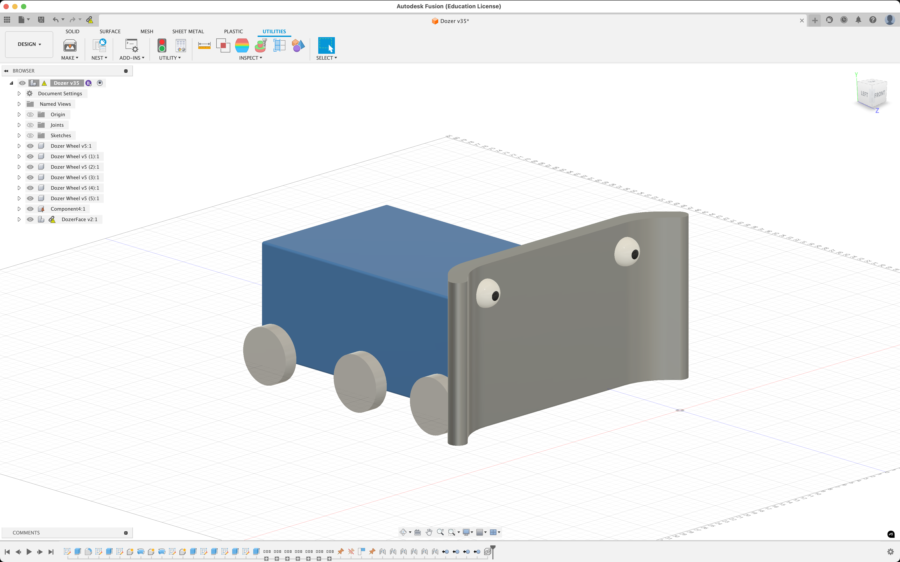
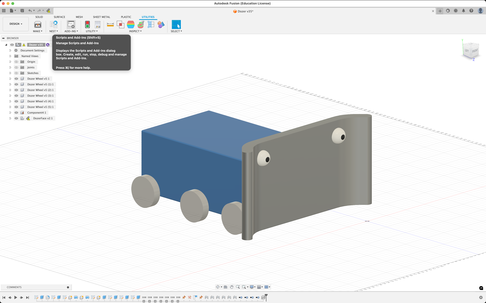
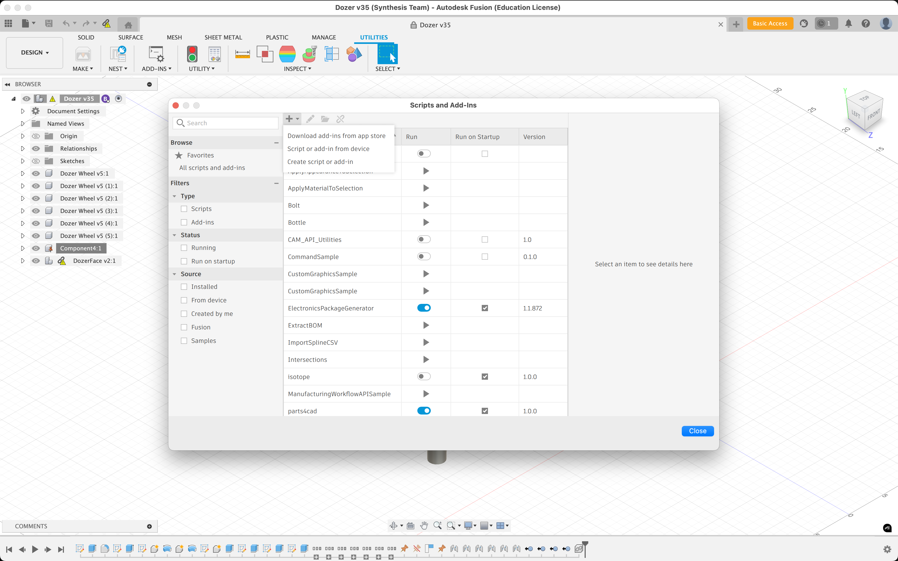
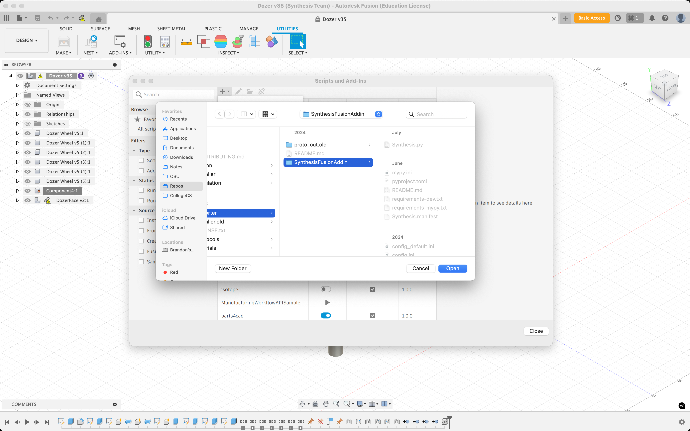
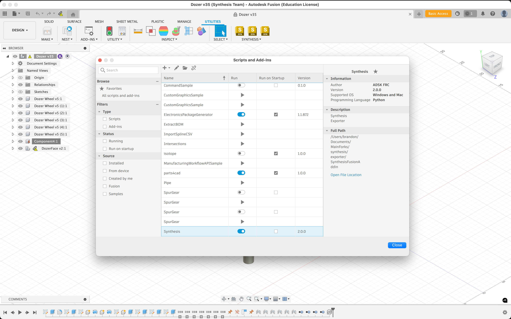
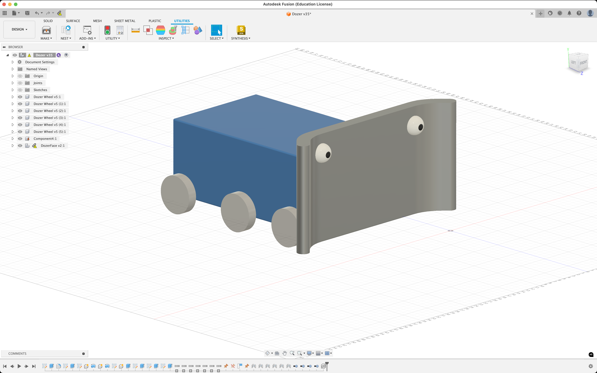
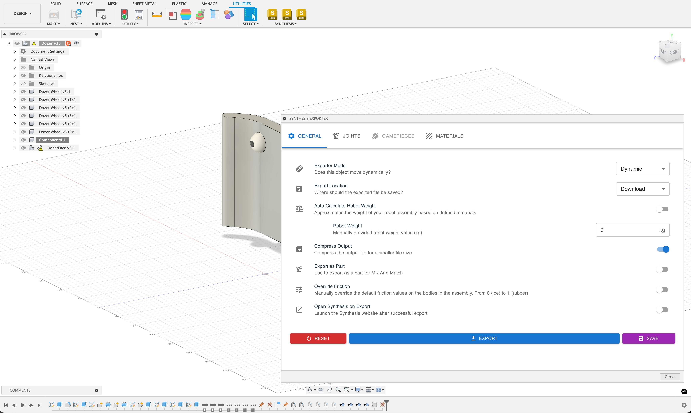
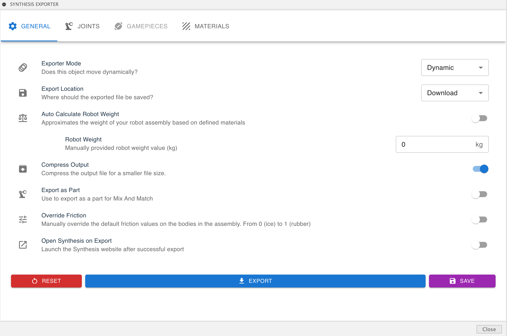
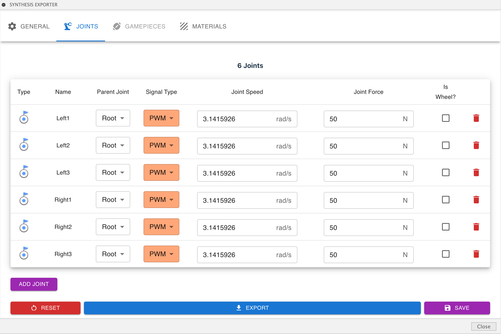
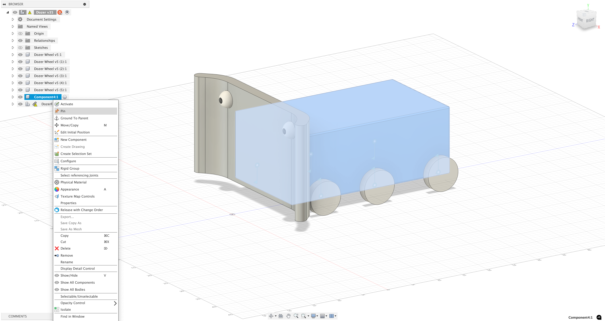

author: Synthesis Team
summary: Tutorial for using Fusion360 exporter
id: FusionExporterCodelab
tags: Python, Exporter, CAD
categories: Python, CAD
environments: Fusion360
status: Draft
feedback link: https://github.com/Autodesk/synthesis/issues

# Synthesis Fusion 360 Exporter Addin

## Intro

The Synthesis Fusion 360 exporter is the tool used by both developers and users to export their CAD models into the Synthesis simulator. The exporter comes as an optional install component of every version of synthesis and requires Fusion 360 to be installed.

For information regarding the manual install process visit the [Synthesis Fusion 360 Exporter](https://github.com/Autodesk/synthesis/tree/prod/exporter) source code for more information.

## Installing the Exporter

### Using an Installer

- Visit [synthesis.autodesk.com/download](https://synthesis.autodesk.com/download.html) and select the installer for your operating system.
  - Note that there is no installer for Linux since Fusion is only supported on Windows and Mac.
- Once you have downloaded the installer for your operating system (`.exe` for Windows and `.pkg` for Mac) go ahead and run the executable.
  - Since we do not code sign our installers (as interns of Autodesk we have very little control over this) you may get a warning from your operating system.
  - For Mac to get around this see [this](https://support.apple.com/en-tm/guide/mac-help/mh40616/mac) guide for more information.
- If you are at all concerned that we are doing something nefarious please feel free to [install the exporter manually.](#manual-install)
  - Alternatively, you can even inspect how we build our installers [here](./exporter/) and build them yourself.

###  Manual Install

- Navigate to [`synthesis.autodesk.com/download`](https://synthesis.autodesk.com/download.html).
- Find the Exporter source code zip download.
  - Note that the source code is platform agnostic, it will work for **both** `Windows` and `Mac`.
- Once the source code for the Exporter is downloaded unzip the folder.
- Next, if you haven't already, install `Autodesk Fusion`.
- Once Fusion is open, navigate to the `Utilities Toolbar`.

- Click on `Scripts and Add-ins` in the toolbar.

- Navigate to `Add-ins`, click on the plus at the top and navigate to `Script or add-in from device`.

- Now navigate to wherever you extracted the original `.zip` source code file you downloaded.
  - Make sure to select the folder that contains the `Synthesis.py` file, this is the entry point to the Exporter.

- Select `Synthesis` from the addins panel and check `Run`.
- Optionally select `Run on Startup` (this may already be checked in some builds of the Exporter).

- The first time you run the extension it may prompt you to restart Fusion, this is totally normal.
- Once you restart Fusion the extension will run on startup, you will be able to find it on the right side of the toolbar
under the `Utilities` tab.

Thanks for installing the Synthesis Fusion Exporter! For any additional help visit our [Synthesis Community Discord Server](https://www.discord.gg/hHcF9AVgZA) where you can talk directly to our developers.

## Exporting Robots

### Launching the Exporter

After clicking the button, a panel will open up. This is the exporter. In this panel, you can provide us with most of the extra data we need to properly simulate your robot or field in Synthesis.

### General Tab

This is where you will do most of your configuring. Here is a basic overview of the options you will find in the general tab.

- **Export Mode**:
  - **Dynamic**: This exports in the robot mode. This means the object will be completely movable by default.
  - **Static**: This exports in the field mode. Fields are essentially non-controllable robots with a fixed grounded node.
- **Weight**:
  - The weight of your exported model. This is used for physics calculations within Synthesis, however, it does not need to be exact. If you happen to know the real world weight of your robot put that here. Otherwise toggle the `Auto Calculate` switch to have the exporter estimate the weight for you. This works best when the materials are defined in Fusion
  - Note: The weight will be measured `kg`s.
- **Compress Output**: Compresses resulting mirabuf file with GZip
- **Open Synthesis**: Opens Synthesis when the export is finished
- **Friction Override**: Manually set a friction level for the entire mirabuf file (default 0.5)

### Joints Tab

- This is where you will select all moving joints on your robot, including those that are a part of your drivetrain.
  - All joints are added to this list by default.
  - If you want to remove a joint, either suppress it in Fusion or manually remove it from the list.
- Indicate which joints are part of the drivetrain by checking the "Is Wheel" box.
  - This will cause them to appear in the wheels table below
- You can also change the signal type of the joint (PWM and CAN for simulation. Passive to not be controlled). This is not used when controlling the robot through Synthesis, but determines how code simulation mappings work
- Joint speed and force are default values for importing, these can be adjusted in the simulator.

Notes:

- All parts of your robot that you want to be movable must have their joints configured in the exporter. Otherwise the exporter will automatically attempt to ground the part. This is the cause for many problems relating to robots not moving expectedly.
- When selecting your joints it is important that your robot is structured correctly. See [Design Hierarchy](#design-hierarchy) for more information.

Note that some of these features are currently still experimental and may not be working or behave as expected.

## Design Hierarchy

Synthesis not only relies on the joints between parts to determine structure of your robot or field, but also the hierarchy of all the parts in the design. If you look at the browser, you can see the parent child relationship between all our your parts, and it is important that you have them set correctly in order to ensure Synthesis knows your intentions.

Problems associated with incorrect design hierarchy account for the majority of issues users have with the exporter. It's extremely important to plan out your robot structure before you begin.

The term node refers to a collection of parts that **don't** move relative to each other.

### Basic Rules

Below is a basic overview of the design hierarchy rules that the exporter expects your CAD model to follow. It is possible to export a robot without following any of these rules, however, your model will likely not behave as expected once in the simulator.

#### 1. Grounded Node

In order for our exporter to properly parse your design, you need to choose a component for the exporter to start at. To do this, you must pin a component. This is what we refer to internally as the 'grounded' or 'root' node of your design. Note that this conflicts with Fusion's language of grounded components.

This tells Synthesis where to start branching off the rest of the nodes from. In the browser, you'll see there is a main root component. All other components under this root component will actually be used in the export. **NOTE**: Generally anything that is *underdefined* or *"disjointed"* from the rest of the design will be added under the main grounded object, so if objects that are supposed to be moving relative to what you define as grounded aren't, that is likely why.
All child components of the component that is grounded (and disjointed components) will be attached to the grounded node. If a component is associated with any joint (rigidgroups are a big exception here) will not be attached to the grounded. Instead, they will start creating their own node. As a result, if you joint two child components together, it will create those components (and their children) as completely separate objects in Synthesis. You will need to specify which component in the joint should remain with the grounded node.

#### 2. Rigidgroups

Rigidgroups act as a bandage. They ensure that whatever components are within the rigidgroup exist in the same node. Use this to ensure which side of the joint should remain in the grounded joint.

#### 3. Sub-joints

You can follow the same logic as the grounded node, but instead its stemming from that parented joint.

## Video Walkthrough

Watch the video below to walk through exporting the Dozer model.

<video id="RVsX7CZn1Pg"></video>

## Need More Help?

If you need help with anything regarding Synthesis or it's related features please reach out through our
[Discord](https://www.discord.gg/hHcF9AVgZA). It's the best way to get in contact with the community and our current developers.
