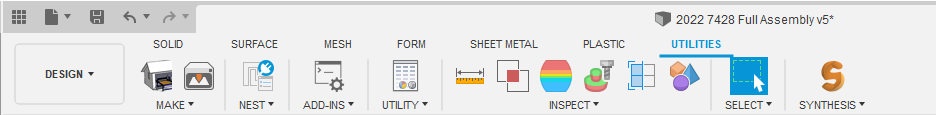

author: Synthesis Team
summary: Tutorial for using Fusion360 exporter
id: FusionExporterCodelab
tags: Python, Exporter, CAD
categories: Python, CAD
environments: Fusion360
status: Published
feedback link: https://github.com/Autodesk/synthesis/issues

# Synthesis Fusion 360 Exporter Addin

## Intro

After installing Synthesis, the exporter addin should automatically start up when you open Fusion360. Navigate to the Utilities tab and you should see a Synthesis button.

After clicking the button, a panel will open up. This is the exporter. In this panel, you can provide us with most of the extra data we need to properly simulate your robot or field in Synthesis.

### General Tab

The general tab is where you'll do most of the configuring.
The first option in the general tab is the `Export Mode`

**Dynamic** -> This exports in the robot mode. General means the object will be completely movable by default\
**Static** -> This exports in the field mode. Fields are essentially non-controllable robots with a fixed grounded node.

### Advanced Tab

The advanced tab has some optional toggles to disable/enable some features.

## Design Hierarchy

Synthesis not only relys on the joints between parts to determine structure of your robot or field, but also the hierarchy of all the parts in the design.
If you look at the browser, you can see the parent child relation ship between all our your parts, and it is important that you have them set correctly in order to ensure Synthesis knows your intentions.
 
The term node means a collection of parts that don't move relative to eachother. We use that term a lot in.

### Basic Rules

#### 1. Grounded Node

You must ground one of your parts in the design. This tells Synthesis where to start branching off the rest of the nodes from.
In the browser, you'll see there is a main root component. All other components under this root component will actually be used in the export.
NOTE: Generally anything that is underdefined or "disjointed" from the rest of the design will be added under the grounded object, so if objects that are supposed to be moving relative to what you define as grounded aren't, that is likely why.
 
All child components of the component that is grounded (and disjointed components) will be attached to the grounded node.
If a component is associated with any joint (rigidgroups are a big exception here) will not be attached to the grounded. Instead, they will start creating their own node.
As a result, if you joint two child components together, it will create those components (and their children) as completely separate objects in Synthesis. You will need
to specify which component in the joint should remain with the grounded node.

#### 2. Rigidgroups

Rigidgroups act as a bandage. They ensure that whatever components are within the rigidgroup exist in the same node. Use this to ensure which side of the joint should remain in the grounded joint.

#### 3. Sub-joints

You can follow the same logic as the grounded node, but instead its stemming from that parent joint.

## Robots

### Weight

Click the `Calculate` button to automatically calculate the weight. This uses the physical material and calculated volume of each object to determine the realistic weight and center of mass of the Assembly.
The default physical material is steel so if your robot is heavier than expected, check the physical materials that are being used.
You can also specify a total weight for your robot to override the calculated one.

### Wheel Configuration

If your robot has a drivetrain, you'll need to add the joints for the wheels. Click the `Add` button, then either click the joint in the main 3D viewer or find it in the browser on the left. You can remove wheels by selecting the joint you wish to remove and clicking the `Remove` button.

You can specify a wheel type (however, currently only standard is supported).

The signal type specifies what type of IO is used to control the wheel. This will be used when user control via custom code is reintegrated.

### Joint Configuration

You can configure each type joint that will be used in the robot. All joints are automatically added to the list. If you want to ignore a joint you can either supress it, or remove it from the list. In the list, you can specify a max rotational speed for the joint, along with a stall torque for the joint.
 
NOTE: These are not super accurate in Synthesis atm. They will be getting updates to be more accurate to user definitions for max angular speed and stall torque.
 
NOTE: Linear joints are not fully supported yet.
 
You can also specify a parent joint that the joint is supposed to stem from.

## Need more help?

If you need any help with the process, feel free to join our [Discord](https://www.discord.gg/hHcF9AVgZA) where you can be in direct contact with Synthesis developers.
