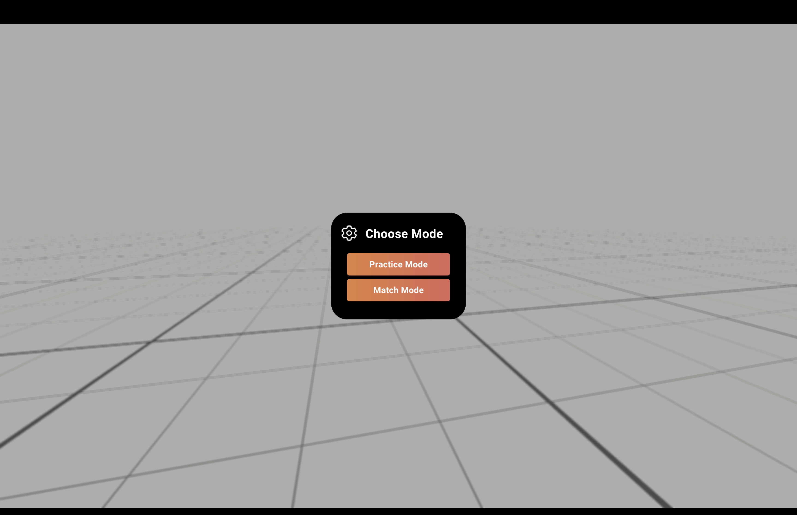
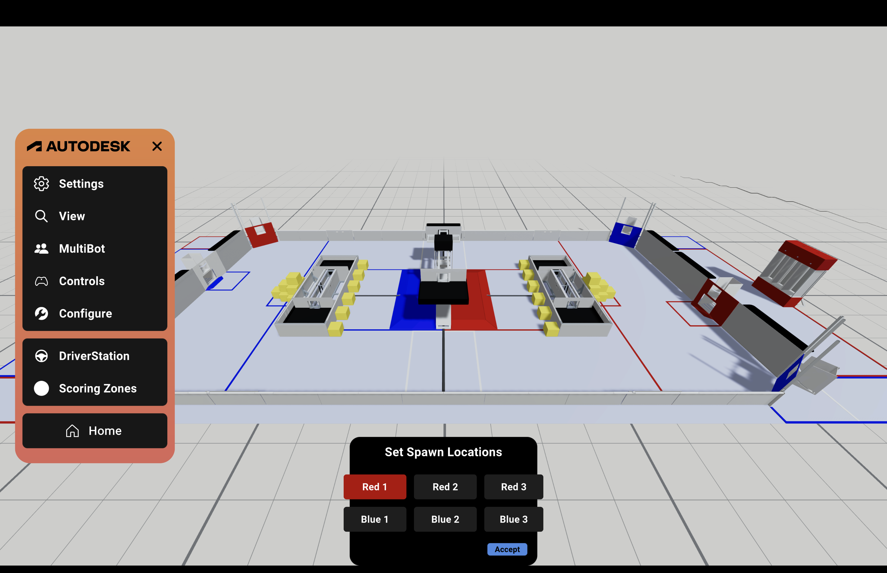
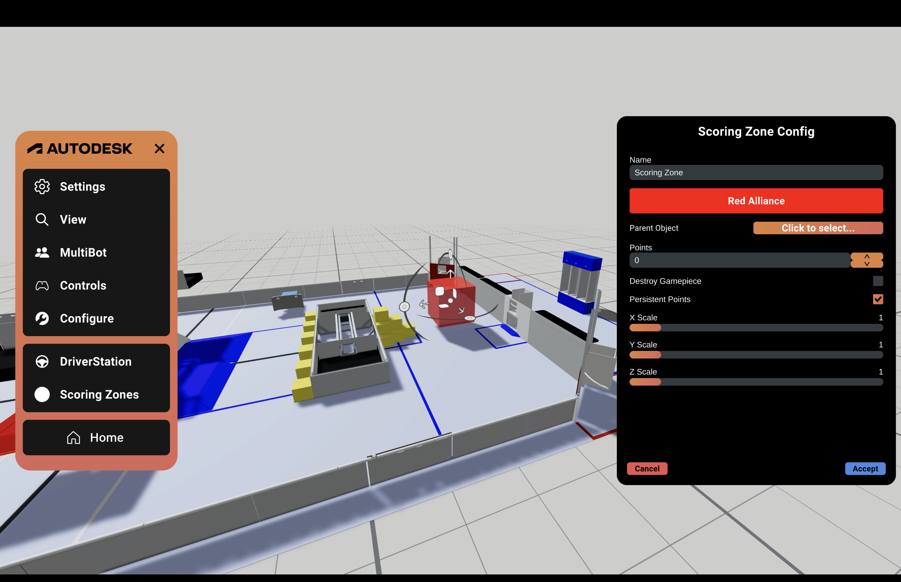
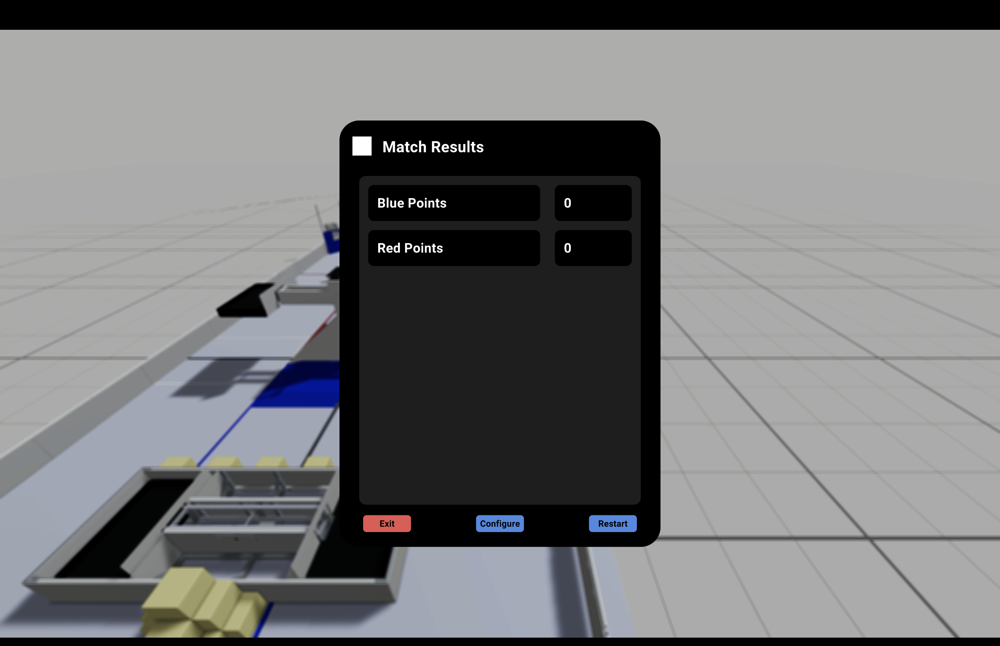

author: Synthesis Team
summary: Tutorial for using Match Mode
id: MatchModeCodelab
tags: Match Mode, Modes, Game Simulation
categories: Modes
environments: Synthesis
status: Draft
feedback link: https://github.com/Autodesk/synthesis/issues

# Match Mode in Synthesis

## Intro

Match Mode is a new mode in Synthesis that allows you to simulate a FIRST match using a field of your choice, complete with alliances and a scoreboard to track points.

### Accessing Match Mode

After opening Synthesis, select Single Player. There, you should be able to choose between Practice Mode and Match Mode.

### Preparing a Match

Once Match Mode is selected, you will be able to choose your robots for each alliance, as well as a field. 

Next, you will be able to view your selected field and set the spawn locations for each robot. You can spawn your robots anywhere within the field by selecting each robot and clicking on the location.

## Scoring Zones

### Setting Up Scoring Zones

After setting your robot’s spawning locations, you can place down scoring zones anywhere on the field. Using the controls on the panel, you can change the scoring zone’s dimensions and adjust how many points each zone is worth. 

* Parent Object:
  * For fields with dynamic field elements, you can anchor a scoring zone to a parent object by selecting a part of the field model, allowing the scoring zone to move with the selected object.
* Destroy Game Piece:
  * When enabled, game pieces will disappear once placed in the scoring zone.  
* Persistent Points:
  * Points earned remain even when the game piece leaves the scoring zone.

### Beginning a Match

Once you have set your scoring zones, the match will begin. There is a 15 second phase meant to mirror autonomous mode, followed by the 135 second tele-op period. Each phase is marked with FRC field audio.

At the end of the match, you will get a panel showing the points earned. Here, you have the option to exit out of match mode, restart the match, or reconfigure the match with different bots or a different field.

## Need More Help?

If you need help with anything regarding Synthesis or it's related features please reach out through our
[discord sever](https://www.discord.gg/hHcF9AVgZA). It's the best way to get in contact with the community and our current developers.
