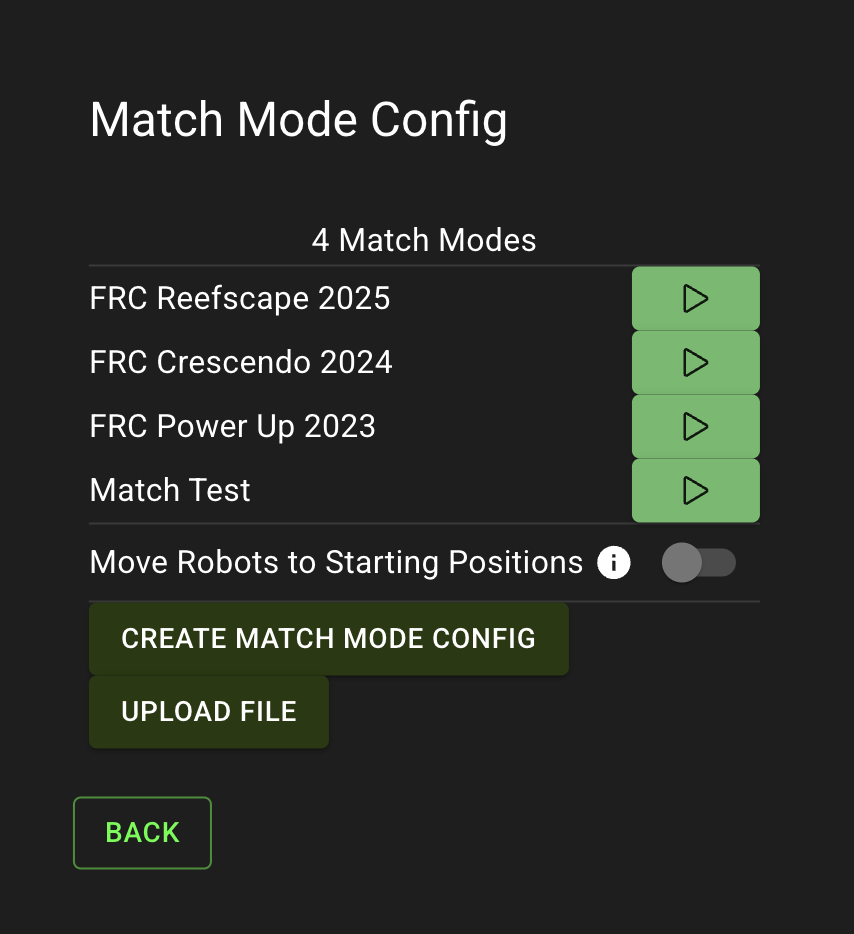
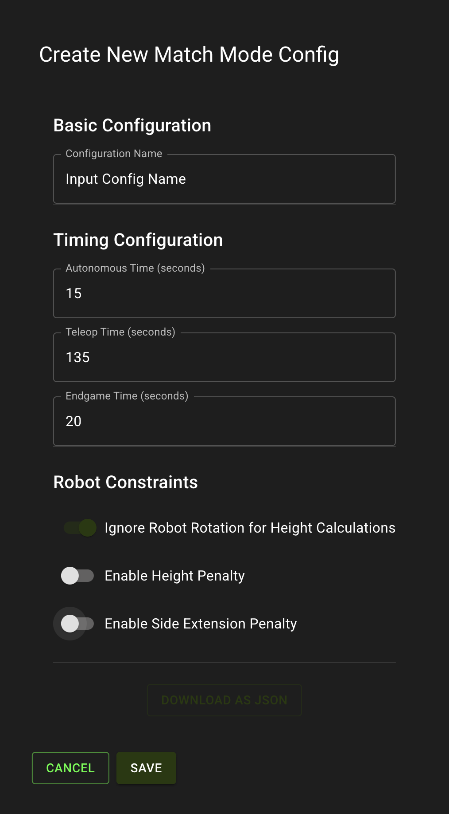
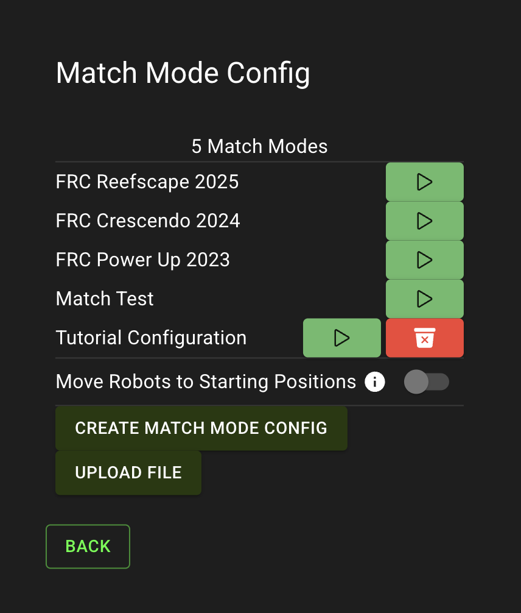

author: Synthesis Team
summary: Tutorial for starting a simulated match.
id: MatchMode
tags: Match, Gameplay, Simulate
categories: Gameplay
environments: Synthesis
status: Draft
feedback link: https://github.com/Autodesk/synthesis/issues

## Introduction

Match mode in Synthesis simulates competitive robotics matches with autonomous and teleoperated periods, mimicking real competition environments. It also keeps track of individual robot scores and penalties, giving a breakdown at the end. 

## Starting a Match

To get started with running a match, first spawn and configure the field and robot(s) you want to use as you normally would (link to spawning robot tutorial). 

Next, open up the MainHUD and press start match mode.

This will open up the Match Mode Config panel, where you can configure the match mode parameters. 

There are multiple pre-configured match modes. If you’re simulating a match for a specific year, simply select the corresponding ruleset. This will start the match. You can always stop the match by opening the MainHUD and pressing the abort match mode button that appears in place of start match. 

## Creating Custom Configuration

If you want to customize the ruleset press the "Create Match Mode Config" button. This opens a panel with all the properties you can customize.

Go through and input the values that you want in the configuration. 

Click Save to store it locally in the cache. Or click Download to save the config as a .json file to your device. 

After pressing save you will be back in the config panel, and your new config should now appear there. 

Select the config you now created, and the match will start. 

If using a downloaded .json, click Upload File, and select your saved config. 

## Need More Help?

If you need help with anything regarding Synthesis or it's related features please reach out through our
[discord](https://www.discord.gg/hHcF9AVgZA). It's the best way to get in contact with the community and our current developers.
