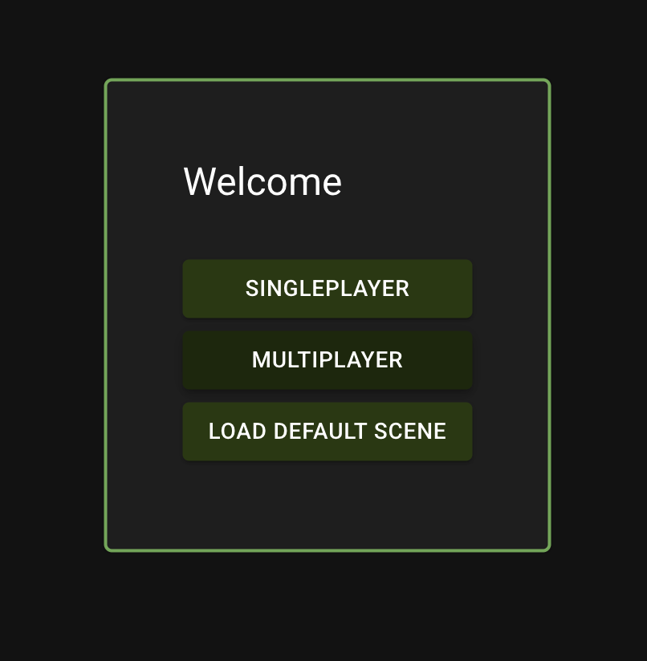
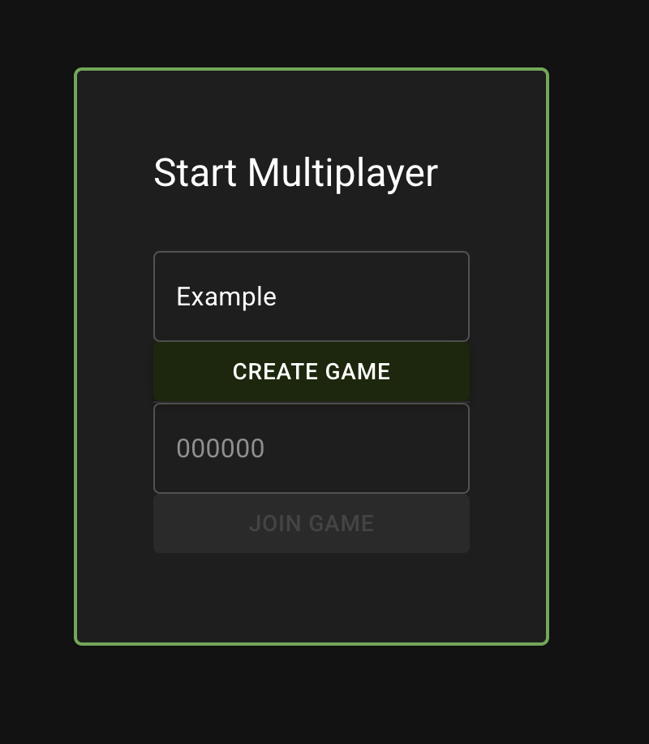
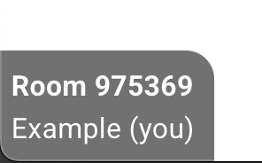
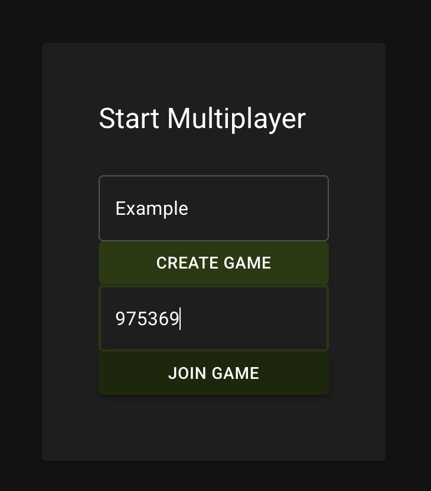

author: Synthesis Team
summary: Tutorial for simulating the same world on multiple devices.
id: Multiplayer
tags: Multiplayer, WiFi
categories: Gameplay
environments: Synthesis
status: Draft
feedback link: https://github.com/Autodesk/synthesis/issues

## Introduction

The Multiplayer mode will allow you to host a simulation world to access across multiple devices

### Requirements

- All players must be on the same network and able to communicate directly to one another
  - Note that some school/company networks block this kind of communication
  - This limitation may be resolved in future releases

## Setup

- After selecting multiplayer from the main menu screen, enter a name (this will be visible to other players in your room) and either:

- Click "Create Game" to generate a room code to share with the other players

- Enter a room code from another player and click "Join Game"

- Anyone can spawn in robots or the field, and will have exclusive control of the robots they spawn in
  - Select a control scheme and configure your robot as you typically would
  - It may take a few seconds for assets to load in for other users, depending on how large they are and if the other user has them cached
  - Configuration (scoring zones, intakes, ejectors, etc.) is sent along with the assets and whenever it changes

## Additional

- You can drive around in the simulator, intake gamepieces, and interact with the field and other robots. All functionality should behave just as it would in the singleplayer version of the simulator
- You will not be able to configure, remove, or control robots spawned by other users
- A list of other players will be shown below the room code in the bottom left corner

### Match Mode

- Just like in Singleplayer, Match Mode will keep track of scores, time remaining, and penalties.
- Any user can start a match and it will also be started for all other users in the room.

## Need More Help?

If you need help with anything regarding Synthesis or it's related features please reach out through our
[Discord](https://www.discord.gg/hHcF9AVgZA). It's the best way to get in contact with the community and our current developers.
