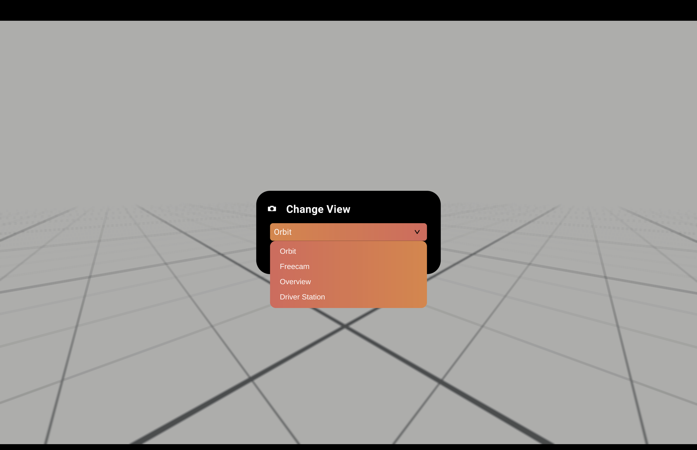
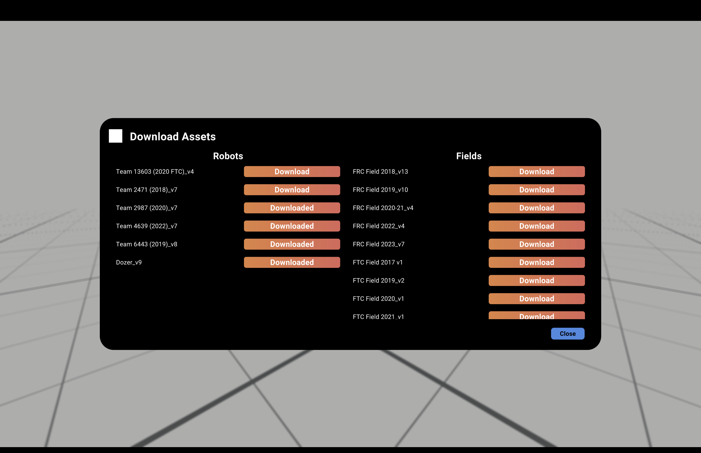

author: Synthesis Team
summary: Tutorial for using Practice Mode
id: PracticeModeCodelab
tags: Practice Mode, Modes, Game Simulation
categories: Modes
environments: Synthesis
status: Draft
feedback link: https://github.com/Autodesk/synthesis/issues

# Practice Mode in Synthesis

## Intro

Practice mode is one of Synthesis’ primary modes, made as an open, unrestricted testing zone.
you can load robots and field models into. 

To load in a model, select Spawn Asset. You’ll be given the choice between spawning a robot and a field. Then you’ll be able to choose which model to generate (Note: If running Synthesis for the first time, make sure to go to Download Assets and and download the preloaded assets, otherwise there will be nothing to spawn).

## View

View refers to your camera view. In Synthesis, there are four types for you to choose from.

- **Orbit**: The default camera view, use left click to rotate the camera and scroll to zoom in. 
- **Freecam**: Freecam gives you full control of the camera. Use right click to rotate the camera, right click plus WASD to move the camera left, right, forward and backwards, and scroll to zoom.
- **Overview**: Overview is a static camera pointed down at the field. Use scroll to zoom in and out.
- **Driver Station**: A camera view meant to mimic a driver’s view from the Driver station. Use right click and WASD to position the camera, and scroll to zoom. This view is similar to Freecam, but always points towards your robot.

## Configure

See our [Configure Mode Tutorial](https://synthesis.autodesk.com/codelab/ConfigModeCodelab/index.html#0) for more information about config mode.

## Download Asset

To download preloaded robots and fields, open Download Assets and select which models you would like to download. 

If this is the first time you are running Synthesis, you won’t be able to spawn anything without downloading the models first.

## Scoring Zones

In Practice Mode, you can set up scoring zones in a spawned field to score points.

For a more indepth view on Scoring Zones, check out our [Scoring Zone Tutorial](https://synthesis.autodesk.com/codelab/MatchModeCodelab/index.html#1).

## Need More Help?

If you need help with anything regarding Synthesis or it's related features please reach out through our
[discord sever](https://www.discord.gg/hHcF9AVgZA). It's the best way to get in contact with the community and our current developers.
