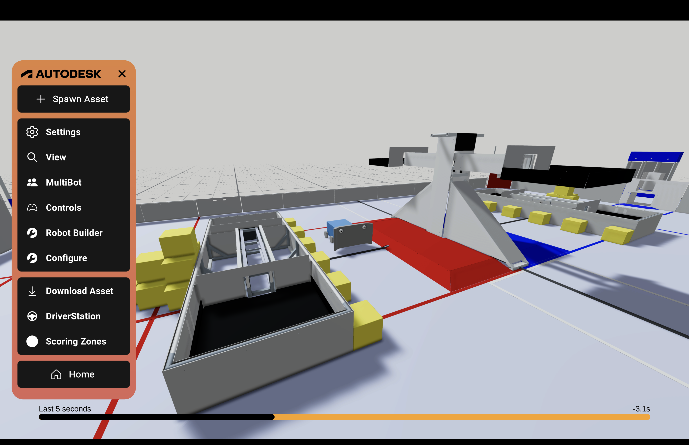

author: Synthesis Team
summary: Tutorial for using Replay Mode
id: ReplayModeCodelab
tags: Game Simulation, Modes
categories: Modes
environments: Synthesis
status: Draft
feedback link: https://github.com/Autodesk/synthesis/issues

# Replay Mode in Synthesis

Replay Mode is a feature that allows you to rewind the **last 5 seconds of game play**.

By hitting `Tab` on your keyboard, a slider will show up on the bottom of your screen.  You can pull the slider in either direction to replay your simulation. Hit `Tab` again to close out of Replay Mode.

## Need More Help?

If you need help with anything regarding Synthesis or it's related features please reach out through our
[discord sever](https://www.discord.gg/hHcF9AVgZA). It's the best way to get in contact with the community and our current developers.
