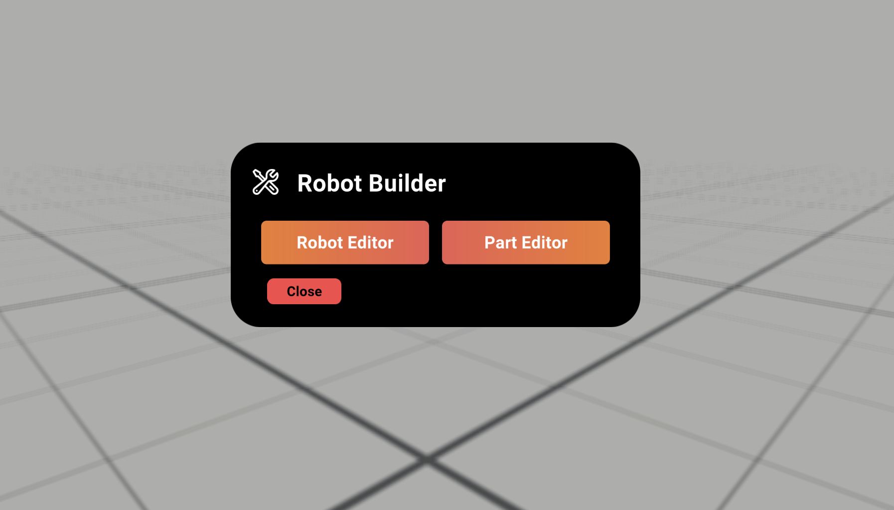
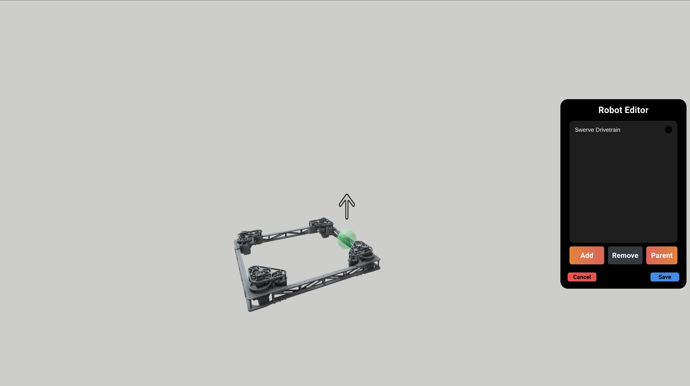
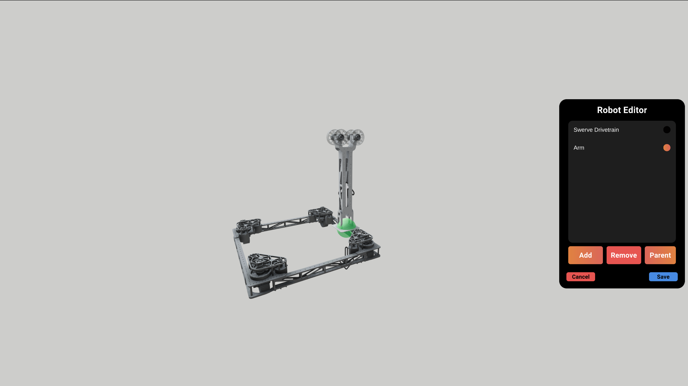

author: Synthesis Team
summary: Tutorial for using the Robot Builder
id: RobotBuilderCodelab
tags: Robot Builder, Modes, Game Simulation
categories: Modes
environments: Synthesis
status: Draft
feedback link: https://github.com/Autodesk/synthesis/issues

# Robot Builder in Synthesis

## Intro

Robot Builder is a new feature in Synthesis that lets you import parts to put together a custom robot, without having to CAD and export a full model from an external software.

## Part Editor

Before building a robot in Robot Editor, you must have parts first. After selecting Part Editor, you’ll see a drop down menu where you can select a part that’s already been made or create a new part.  

In Download Assets, you can download preloaded part files to use in Part Editor. To import custom parts, check out [this](https://synthesis.autodesk.com/codelab/FusionExporterCodelab/index.html#0) page on using Synthesis exporter add in.

### connection Points

Once you enter Part Editor, a panel will open up. In this panel, you can add and remove connection points. These will act as the joint for your part.

When the connection point is selected on the panel, you’ll be able to move and place the connection point as you see fit as well as orient the way an attached part will face by rotating the point. 

The large arrow is an indicator of which way the attached part will face.

## Robot Editor

In Robot Editor, you’re able to use the parts created in Part Editor to put together a robot. Just press Add and select the part you want to use.

Once you have the parts loaded in, use the panel to select a part you want to join. If a part has multiple connection points, you can choose which one to attach your second part to by moving your cursor over the point.

### Using Your Custom Robot

To use the robot you made in Robot Builder, go to Spawn Asset, select Robot, then select Custom. You should then get a drop down menu with your robot listed. Once you hit load, it will spawn in like a regular robot.

## Need More Help?

If you need help with anything regarding Synthesis or it's related features please reach out through our
[discord sever](https://www.discord.gg/hHcF9AVgZA). It's the best way to get in contact with the community and our current developers.
