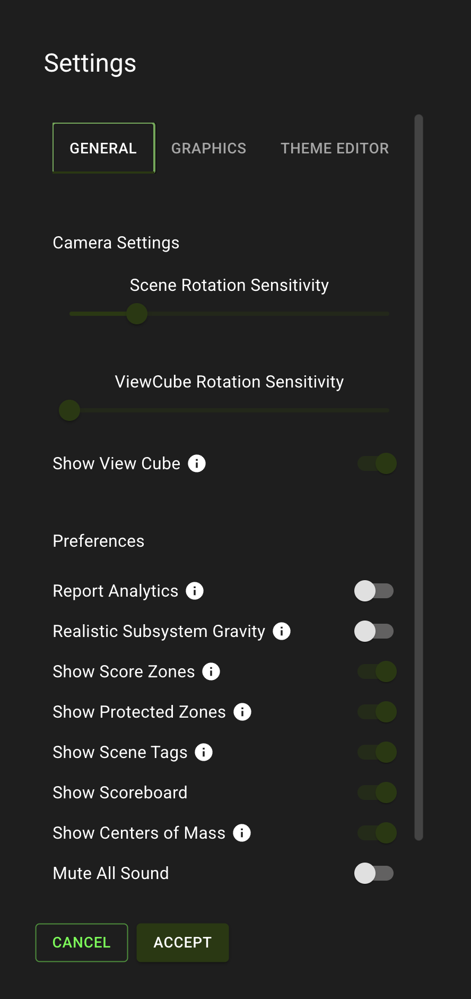
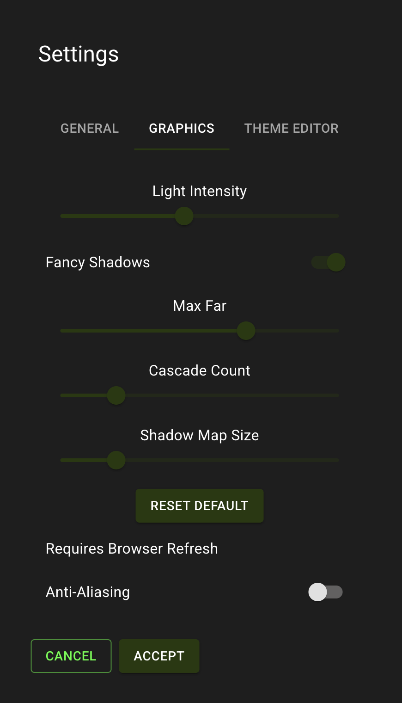
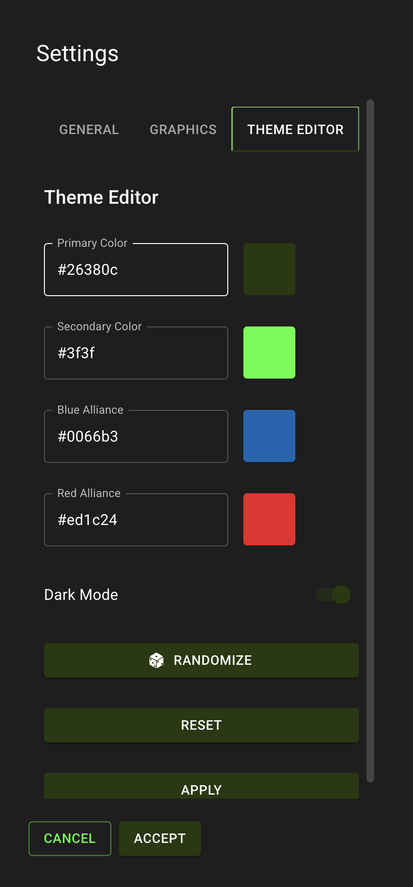

author: Synthesis Team
summary: Documentation for simulation settings.
id: Settings
tags: Settings, Performance, Graphics, Theme, Scoreboard
categories: Customization
environments: Synthesis
status: Draft
feedback link: https://github.com/Autodesk/synthesis/issues

## General Settings

The general settings panel allows you to configure options such as drag sensitivity, toggling the scoreboard, muting sounds, etc...

Note that for each of the settings, you may hover over the 'i' icon for an explaination of that setting.

## Graphics

The graphics settings allows you to increase and decrease the shadow quality for performance.

- Light intensity: changes the brightness
- Fancy Shadows: enables cascading shadows
  - Max Far: how far the camera has to zoom out before the shadows stop rendering
  - Cascade Count: How many cascades of shadow qualities there are
  - Shadow Map Size: Texture Quality

If enabling Anti-Aliasing, your browser will force refresh when you click "Accept" causing any currently spawned assets to disappear.

## Theme

Configure the Synthesis theme colors and alliance colors. This will save to your browser and apply even if you refresh.

## Need More Help?

If you need help with anything regarding Synthesis or it's related features please reach out through our
[Discord](https://www.discord.gg/hHcF9AVgZA). It's the best way to get in contact with the community and our current developers.
