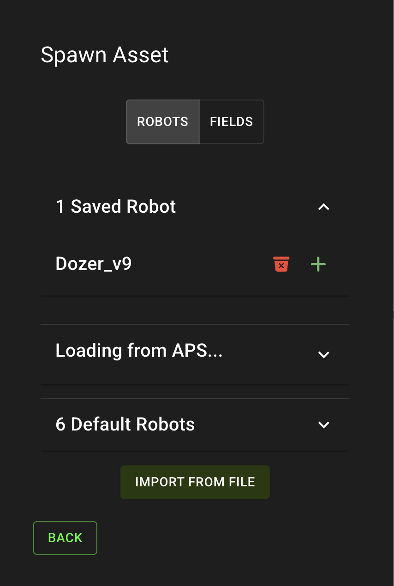
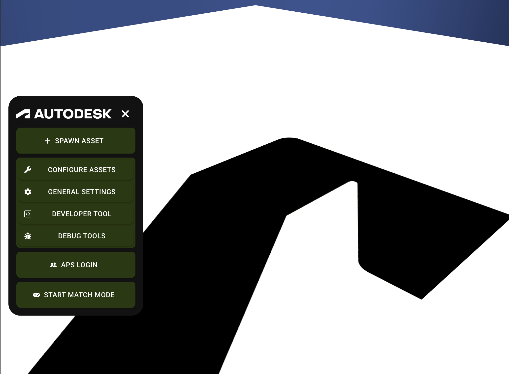
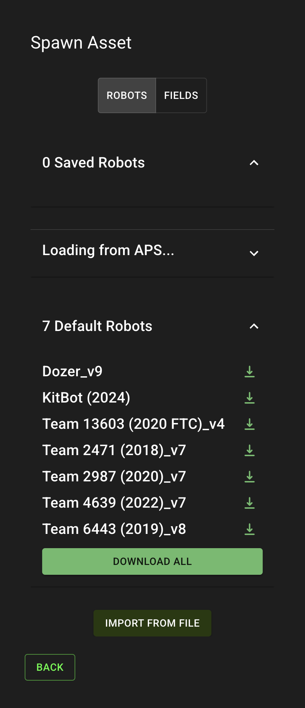
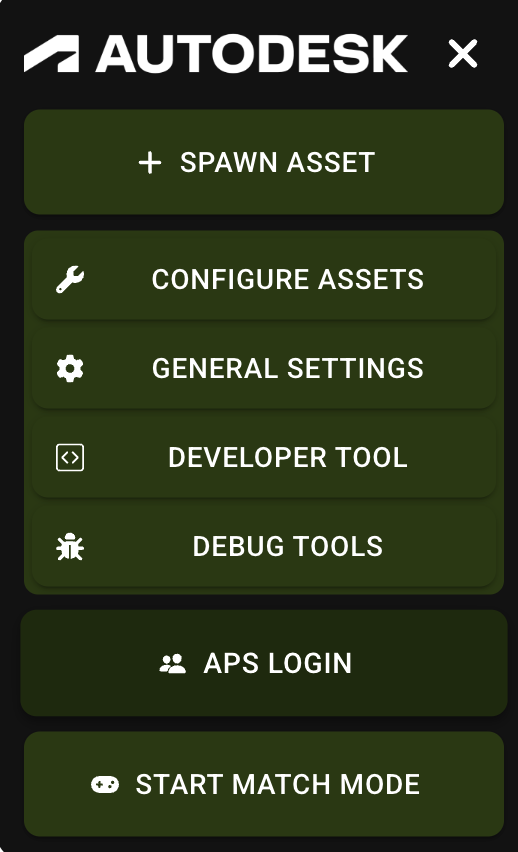
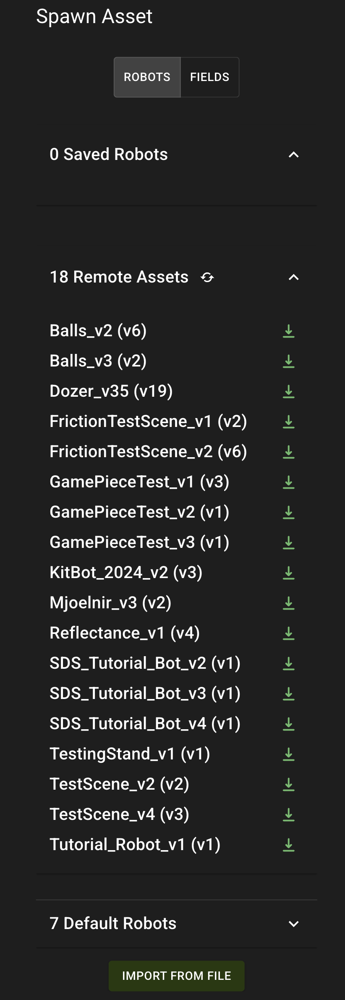
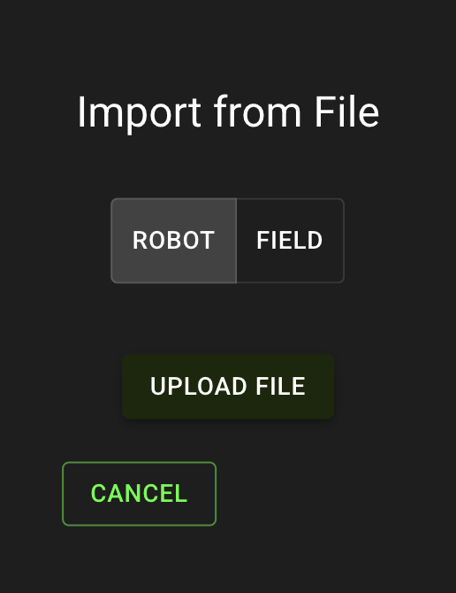
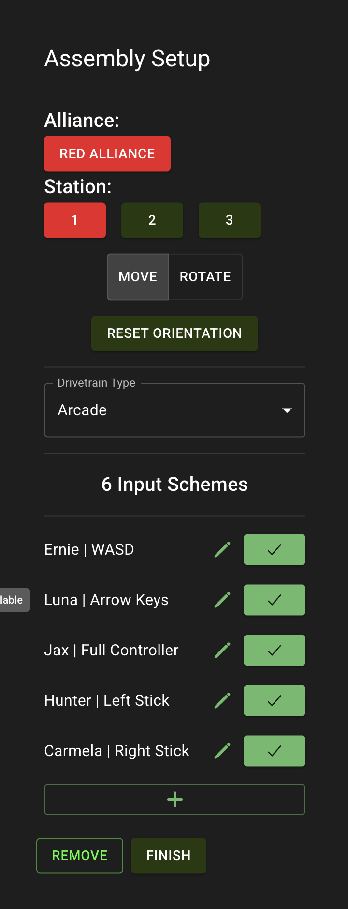
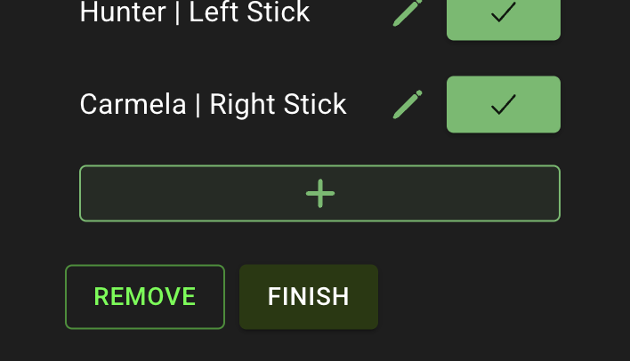
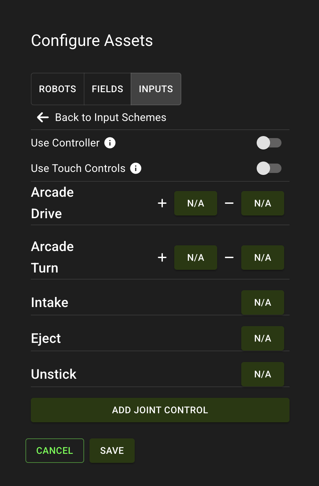

author: Synthesis Team
summary: Tutorial for spawning robots and fields.
id: SpawnAsset
tags: Spawn, Import, Add
categories: Gameplay
environments: Synthesis
status: Draft
feedback link: https://github.com/Autodesk/synthesis/issues

## Abstract

The spawn asset button on the Main HUD allows you to add robots or fields into the simulation world. There are three ways to spawn assets:

- Default remote assets provided by the Synthesis team
- Exported assemblies from Fusion through APS
- Importing local .mira file

Spawning an asset will allow you to take a virtual tour of this year's game field or even interact with it using your team's robot. Gamepieces are automatically spawned with remote fields and are free for robot interaction.

This tutorial details how to take your exported assemblies from Fusion and add them to the simulation world in Synthesis & add default robots such as Dozer or Kitbot to play around with.

## Spawning default assets

Click the "Spawn Asset" button on the Main HUD.

Expand the "Default Robots" dropdown and click the "+" button next to the robot or field you would like to spawn.

## Spawning remote assembly

This section details how to spawn an uploaded Fusion assembly through the APS (Autodesk Platform Services) system.

### Logging into APS

Navigate to the Main HUD where you will see the button "APS Login".

Log into the same Autodesk account that you used when exporting the custom assembly in Fusion.

### Viewing Remote assemblies

On the MainHUD, click the "Spawn Asset" button, then click the dropdown next to "~ Remote Assets" to reveal all of your APS exported assemblies from Fusion. Click the "+" button next to the assembly you would like to spawn.

### Debugging

Ensure that when exporting the robot, you click "Upload" as the export type & ensure the export succeeds.

## Spawning local assembly

In the "Spawn Asset Panel", click the "Import from File" button.

In the Import File panel, select whether you are importing a Robot or Field.

Click the Upload File button and select the local .mira file using your device's file explorer.

## Configuring Input Schemes

Each robot will have it's own unique `Input Scheme` to dictate which keys control it.

Pressing the Enter key will automatically assign the topmost scheme to your robot and place it at its current position.

### Setting Alliance

The Alliance and Station selection will tell the simulator where to spawn your robot when a match mode is started. This can be configured later in the "Configure Assets" panel.

### Positioning the robot

Using the transform gizmos, drag the robot to your desired location in the simulation world & rotate it before pressing "Finish". With the transform gizmos attached, the robot will not be affected by Physics and will phase through objects.

### Custom Input Schemes

To add an Input Scheme, click the "+" button at the bottom of the "Assembly Setup" panel.

Follow the steps in the simulator to add a name for your scheme and set the drive train type.

This will open the "Configure Assets" panel in which you can set the different keybinds for your Input Scheme. 
- Arcade Drive "+" - Drives the robot forward
- Arcade Drive "-" - Drives the robot backward
- Arcade Turn "+" - Turns the robot to the local right
- Arcade Turn "-" - Turns the robot to the local left

Configure your joints if exported from Fusion to control them in the simulator.

## Video Walkthrough

Watch the video below to walk through spawning local .mira files and the default remote assets.

<video id="u608dgHAc2s"></video>

## Need More Help?

If you need help with anything regarding Synthesis or it's related features please reach out through our
[Discord](https://www.discord.gg/hHcF9AVgZA). It's the best way to get in contact with the community and our current developers.
