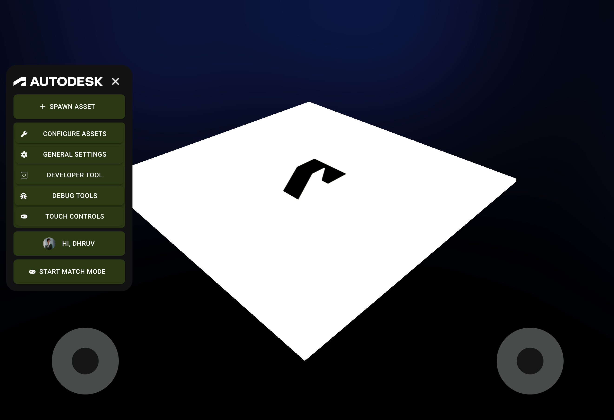

author: Synthesis Team
summary: Tutorial using the mobile interface to control and configure robots.
id: TouchControls
tags: Mobile, Phone, Tablet, Touch, Joysticks
categories: Mobile
environments: Synthesis
status: Draft
feedback link: https://github.com/Autodesk/synthesis/issues

## Requirements

Touch controls will only be avalible on devices that have touch screen capabilities including phones, tablets, and touch screen laptops.

## Setup

If on a compatible device, the "Touch Controls" button will appear on the MainHUD. Clicking the button, the touch control joysticks will appear.

Alternatively, when spawning an robot, set the input scheme to "Brandon" which will automatically spawn the joysticks.

## Need More Help?

If you need help with anything regarding Synthesis or it's related features please reach out through our
[discord](https://www.discord.gg/hHcF9AVgZA). It's the best way to get in contact with the community and our current developers.
