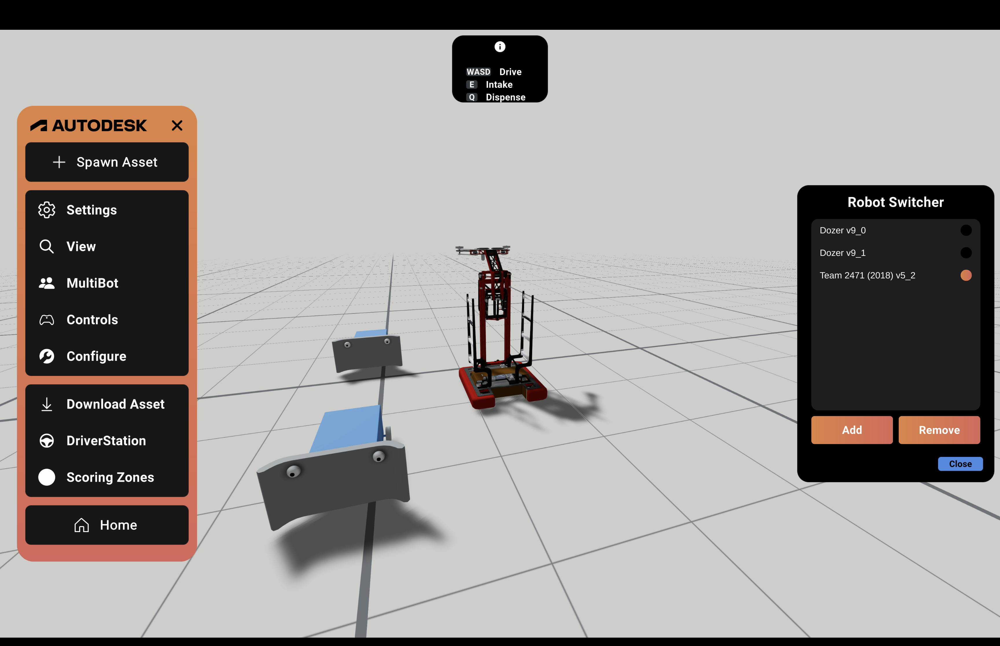
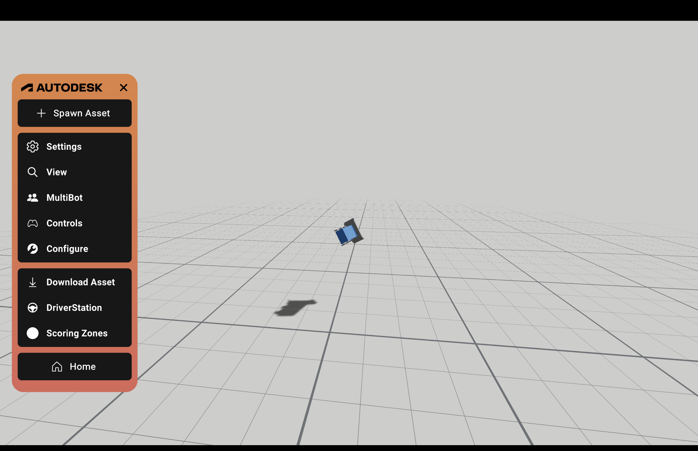
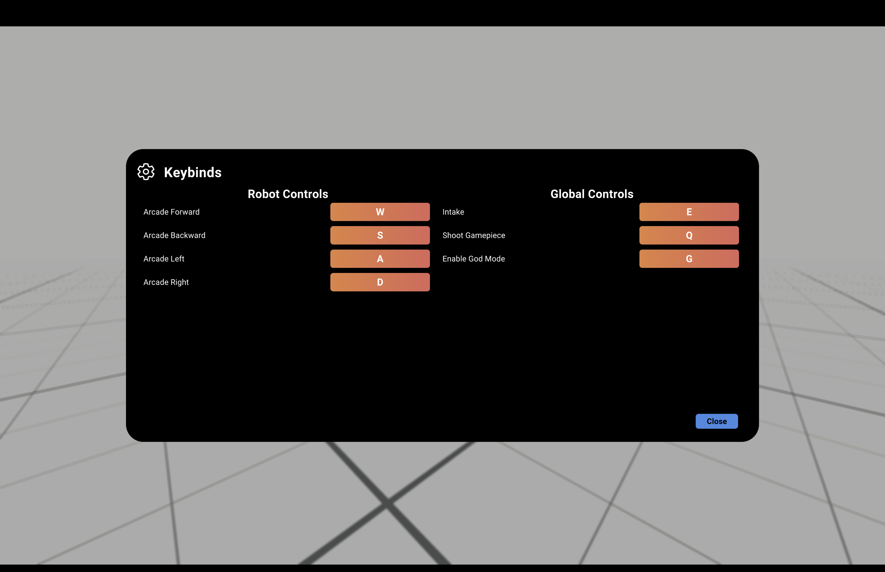
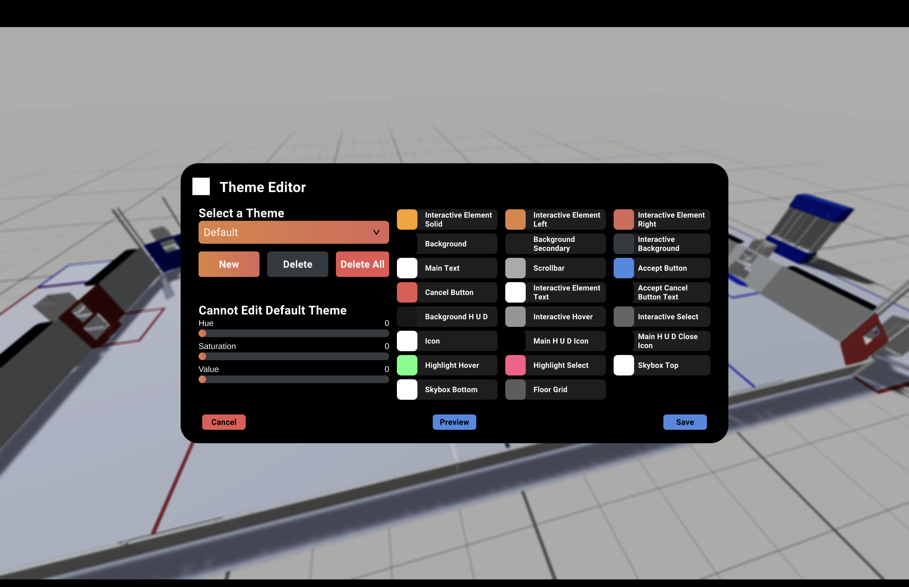

author: Synthesis Team
summary: Tutorial for using different utility settings within the simulator
id: UtilitiesCodelab
tags: Match Mode, Practice Mode, Game Simulation
categories: Settings
environments: Synthesis
status: Draft
feedback link: https://github.com/Autodesk/synthesis/issues

# Synthesis Utilities

## Multibot

In practice mode, you can spawn in multiple robots. Just click on Spawn Asset, and
select which robot you’d like to load.

Multibot is a feature that allows you to switch between different robots that you
have on the field. It also allows you to load in additional bots, or remove
unwanted ones.

## God Mode

When you open up the control panel, there is a keybind for something called `God Mode`. 
When `G` is held (or whichever key you choose) you have the ability to pick up and drag any dynamic / movable object, including the robot.  

Pictured here is a robot being dragged while in *God Mode*.

## Settings

Synthesis’ settings panel lets you calibrate your screen size, image quality, camera sensitivity, along with additional preferences:

- **Yaw**: Rotation on the vertical axis
- **Pitch**: Rotation on the horizontal axis
- **Report Analytics**:  When checked, data on how you use Synthesis will be reported back to the developers.
- **Use Metric**: When checked, data on how long Synthesis was used per session will be reported back to the developers.
- **Render Score Zones**: Selecting render scoring zones allows scoring zones you have placed to become visible.

### Theme Editor

Theme Editor is a new feature that allows you to choose between preset themes, as well as create your own custom ones.

## Need More Help?

If you need help with anything regarding Synthesis or it's related features please reach out through our
[discord sever](https://www.discord.gg/hHcF9AVgZA). It's the best way to get in contact with the community and our current developers.
